# A Cookbook of Self-Supervised Learning
> 中文题名：自监督学习指南

## 1 什么是自监督学习及其重要性

自监督学习被称为"智能的暗物质"<sup>1</sup>，是推动机器学习发展的有前景的路径。与受限于标注数据可用性的监督学习不同，自监督方法可以从海量无标注数据中学习 [Chen et al., 2020b, Misra and Maaten, 2020]。自监督学习（SSL）是深度学习在自然语言处理领域取得成功的基础，推动了从自动机器翻译到基于网络规模无标注文本语料库训练的大语言模型等进步 [Brown et al., 2020, Popel et al., 2020]。在计算机视觉领域，SSL 通过 SEER 等模型在 10 亿张图像上训练，突破了数据规模的限制 [Goyal et al., 2021]。计算机视觉的 SSL 方法已经能够匹配甚至在某些情况下超越基于标注数据训练的模型，即使在像 ImageNet 这样竞争激烈的基准测试上也是如此 [Tomasev et al., 2022, He et al., 2020a, Deng et al., 2009]。SSL 还成功应用于其他模态，如视频、音频和时间序列 [Wickstrøm et al., 2022, Liu et al., 2022a, Schiappa et al., 2022a]。

自监督学习基于无标注输入定义一个前置任务，以生成具有描述性和可理解性的表示 [Hastie et al., 2009, Goodfellow et al., 2016]。在自然语言中，一个常见的 SSL 目标是掩码文本中的一个词并预测其周围的词。这种预测词周围上下文的目标鼓励模型捕捉文本中词之间的关系，而无需任何标签。相同的 SSL 模型表示可用于一系列下游任务，如跨语言文本翻译、摘要甚至文本生成等。在计算机视觉中，存在类似的目标，例如 MAE 或 BYOL 等模型学习预测图像的掩码图块或表示 [Grill et al., 2020, He et al., 2022]。其他 SSL 目标鼓励同一图像的两个视图（例如通过添加颜色或裁剪形成）映射到相似的表示。

利用海量无标注数据进行训练的能力带来了许多好处。传统的监督学习方法通常基于可用的标注数据在已知的特定任务上进行训练，而 SSL 则学习适用于多种任务的通用表示。SSL 在医学等领域尤其有用，因为标注成本高昂或无法预先知道具体任务 [Krishnan et al., 2022, Ciga et al., 2022]。还有证据表明，与监督学习对应方法相比，SSL 模型可以学习到对对抗样本、标签损坏和输入扰动更鲁棒且更公平的表示 [Hendrycks et al., 2019, Goyal et al., 2022]。因此，SSL 是一个日益受到关注的领域。然而，就像烹饪一样，训练 SSL 方法是一门精细的艺术，入门门槛很高。

## 1.1 为何需要自监督学习指南

虽然 SSL 的许多组件对研究人员来说并不陌生，但成功训练 SSL 方法涉及从前置任务到训练超参数的一系列令人眼花缭乱的选择。SSL 研究的入门门槛很高，原因在于：(i) 计算成本高，(ii) 缺乏完全透明的论文详细说明充分发挥 SSL 潜力所需的复杂实现，以及 (iii) 缺乏统一的词汇和理论视角来理解 SSL。由于 SSL 建立了一种与传统基于重建的无监督学习方法（如（去噪、变分）自编码器 [Vincent et al., 2008, 2010, Kingma and Welling, 2013]）不同的范式，我们用于统一理解 SSL 的词汇有限。事实上，从单一视角统一 SSL 方法的尝试直到最近一年才开始出现 [HaoChen et al., 2021, Balestriero and LeCun, 2022, Shwartz-Ziv et al., 2022, Garrido et al., 2022b]。如果没有共同的基础来表征 SSL 方法的不同组件，研究人员开始研究 SSL 方法就会更加困难。与此同时，由于 SSL 现已部署到现实世界中，SSL 研究迫切需要新的研究人员。然而，关于 SSL 的泛化保证、公平性属性以及对对抗攻击甚至自然变化的鲁棒性，仍有许多开放的研究问题。这些问题对于 SSL 方法的可靠性至关重要。

此外，以经验驱动的 SSL 包含许多可变部分（主要是超参数），这些部分可能影响最终表示的关键属性，并且在已发表的工作中不一定得到详细说明。也就是说，要开始研究 SSL 方法，必须首先对这些方法进行详尽的实证探究，以充分理解所有这些可变部分的影响和行为。这种实证盲点是很大的限制，因为它们需要大量的计算资源和已有的实践经验。总而言之，看似不同但重叠的方法同时达到当前最优性能、现有理论研究较少以及现实世界中的广泛部署，使得统一技术和配方的指南对于降低 SSL 的研究入门门槛至关重要。

我们的目标是通过以指南的风格奠定 SSL 的基础和最新配方，来降低 SSL 研究的入门门槛。要成功烹饪，你必须首先学习基本技巧：切菜、炒菜等。我们在第 2 节中使用通用词汇介绍自监督学习的基本技术。具体来说，我们描述了方法家族以及连接其目标的理论线索，以提供统一的视角。我们在概念框中突出关键概念，如损失项或训练目标。接下来，厨师必须学会熟练运用技巧来制作美味的菜肴。这需要学习现有配方、准备食材和评估菜肴。在第 3 节中，我们介绍了成功实现 SSL 方法的实践考虑。我们讨论了常见的训练配方，包括超参数选择、如何组装架构和优化器等组件，以及如何评估 SSL 方法。我们还分享了来自顶尖研究人员关于常见训练配置和陷阱的实用技巧。我们希望这本指南能为成功训练和探索自监督学习提供实用的基础。

## 2 SSL 的家族与起源

自 2020 年以来，SSL 方法经历了复兴，这在很大程度上归功于超大数据集和高内存 GPU 的可用性。然而，SSL 的起源可以追溯到深度学习时代的初期。

## 2.1 SSL 的起源

当代方法建立在我们从早期实验中获得的知识之上。在本节中，我们简要概述 2020 年之前 SSL 的主要思想。虽然许多具体方法已不再主流使用，因为它们不再在基准问题上提供当前最优性能，并且不会详细讨论，但这些论文中的思想构成了许多现代方法的基础。例如，恢复输入中缺失或扭曲部分的核心目标，或对比同一图像的两个视图，构成了现代 SSL 方法的基础。SSL 的早期进展集中在开发属于以下（有时重叠）类别的方法：

1. 信息恢复：已经开发了多种方法，这些方法掩码或移除图像中的某些内容，然后训练神经网络恢复缺失的信息。基于着色的 SSL 方法将图像转换为灰度，然后训练网络预测原始的 RGB 值 [Zhang et al., 2016, Larsson et al., 2016, Vondrick et al., 2018]。由于着色需要理解对象语义和边界，着色被证明是一种用于对象分割的早期 SSL 方法。信息恢复最直接的应用是掩码（即移除）图像的一部分，然后训练网络修复缺失的像素值 [Pathak et al., 2016]。这个想法演变为掩码自编码方法 [He et al., 2022]，其中掩码区域是图像图块的集合，可以使用 Transformer 进行预测。

2. 利用视频中的时间关系：虽然本综述的重点是图像（而非视频）处理，但已经开发了一系列专门的方法，通过在视频上进行预训练来学习单图像表示。请注意，信息恢复方法对于视频特别有用，因为视频包含多种可以掩码的信息模态。Wang and Gupta [2015] 使用三元组损失预训练模型，该损失促进两个不同帧中对象表示之间的相似性。生成的模型在对象检测方面表现良好。Pathak et al. [2017] 训练模型预测单帧中对象的运动，并调整生成的特征以解决单帧检测问题。Agrawal et al. [2015] 预测给定多帧的相机自运动。Owens et al. [2016] 提出从视频中移除音轨，然后预测缺失的声音。对于深度映射等专门应用，已经提出了自监督方法，从无标注图像对 [Eigen et al., 2014] 以及后来的单相机视频帧 [Zhou et al., 2017] 中学习单目深度模型。这些方法仍然是一个活跃的研究领域。

3. 学习空间上下文：这类方法训练模型理解场景中对象的相对位置和方向。RotNet [Gidaris et al., 2018] 通过应用随机旋转来掩码重力方向，然后要求模型预测旋转角度。Doersch et al. [2015] 是最早的 SSL 方法之一，它简单地预测图像中两个随机采样图块的相对位置。这种策略后来被"拼图"方法 [Pathak et al., 2016, Noroozi et al., 2018] 取代，这些方法将图像分解为一组不相交的图块，并预测每个图块的相对位置。一个不同的空间任务是学习计数 [Noroozi et al., 2017]：模型以自监督方式训练，输出图像中对象的数量。

4. 将相似图像分组：通过将语义相似的图像分组，可以学习丰富的特征。K-means 聚类是经典机器学习中最广泛使用的方法之一。许多研究已经调整 k-means 以使用神经模型执行 SSL。深度聚类交替进行在特征空间中执行 k-means 为图像分配标签，以及更新模型以尊重这些分配的类别标签 [Caron et al., 2018]。这种方法的更近期处理使用均值漂移更新将特征推向其聚类中心，并已被证明可以补充 BYOL，这是一种基于两个网络的方法，目标是为每个样本预测伪标签 [Koohpayegani et al., 2021]（在第 2.3 节中讨论）。深度聚类的其他改进包括在特征空间中使用最优传输方法以创建更具信息量的聚类 [Asano et al., 2019]。

5. 生成模型：早期有影响力的 SSL 方法是贪婪逐层预训练 [Bengio et al., 2006]，其中深度网络的层使用自编码器损失一次训练一层。当时的一种类似方法使用受限玻尔兹曼机（RBM），可以逐层训练并堆叠以创建深度信念网络 [Hinton et al., 2006]。虽然这些方法后来被更简单的初始化策略和更长的训练运行所取代，但它们在历史上是 SSL 的重要应用，因为它们使得训练第一批"深度"网络成为可能。后来的进展改进了自编码器的表示学习能力，包括去噪自编码器 [Vincent et al., 2008]、跨通道预测 [Zhang et al., 2017] 和深度典型相关自编码器 [Wang et al., 2015]。尽管如此，最终发现当自编码器被要求恢复其输入的缺失部分时，表示的可迁移性更好，从而产生了 SSL 方法的"信息恢复"类别。

生成对抗网络（GAN）[Goodfellow et al., 2014] 由一个图像生成器和一个区分真实图像与生成图像的判别器组成。该模型对的这两个组件都可以在没有监督的情况下训练，并且两者都可能包含对迁移学习有用的知识。早期的 GAN 论文 [Salimans et al., 2016] 使用 GAN 组件进行了下游图像分类的实验。还开发了专门的特征学习例程，这些例程修改判别器 [Springenberg, 2015]、添加生成器 [Dai et al., 2017] 或学习从图像到潜在空间的额外映射 [Donahue et al., 2017]，以改进迁移学习。

6. 多视图不变性：许多现代 SSL 方法，尤其是我们在本文中关注的那些，使用对比学习来创建对简单变换不变的特征表示。对比学习的思想是鼓励模型相似地表示输入的两个增强版本。在对比学习被广泛采用之前，许多方法通过以各种方式强制不变性引领了这一方向。

从无标注数据学习的最流行框架之一是使用弱训练网络为图像应用伪标签，然后以标准监督方式使用这些标签进行训练 [Lee et al., 2013]。这种方法后来通过强制对变换的不变性得到改进。虚拟对抗训练 [Miyato et al., 2018] 使用图像的伪标签训练网络，并额外执行对抗训练，使得学习到的特征几乎对输入图像的微小扰动保持不变。后来的工作侧重于保持对数据增强变换的不变性。

这类方法中重要的早期方法包括 MixMatch [Berthelot et al., 2019]，它通过平均网络在训练图像的几个不同随机增强上的输出来选择伪标签，从而产生增强不变的标签。大约在同一时间，人们发现通过训练网络最大化图像在不同视图下表示之间的互信息可以实现良好的 SSL 性能 [Bachman et al., 2019]。这些基于增强的方法在早期方法和本文关注的当代方法之间架起了一座桥梁。

有了这些起源，我们现在将 SSL 分为四大类：深度度量学习家族、自蒸馏家族、典型相关分析家族和掩码图像建模家族。

## 2.2 深度度量学习家族：SimCLR/NNCLR/MeanSHIFT/SCL

深度度量学习（DML）家族的方法基于鼓励输入的语义变换版本之间相似性的原则。DML 起源于对比损失的思想，该思想将这一原则转化为学习目标。对比损失首先在 [Bromley et al., 1993] 中引入，然后在 [Chopra et al., 2005, Hadsell et al., 2006] 中更正式地定义。在 DML 中，训练网络通过使嵌入接近（或远离）来预测两个输入是否来自同一类别（或不是）。由于数据没有标签，为了识别相似的输入，我们通常使用已知的语义保持变换形成单个输入的变体。输入的变体称为正样本对或正样本；我们希望使其不相似的样本称为负样本。通常有一个边界参数 m，强制来自不同类别的样本之间的距离应大于 m。与对比损失类似，三元组损失 [Weinberger and Saul, 2009, Chechik et al., 2010, Schrof et al., 2015] 具有相似的精神，但由三元组组成：一个查询、一个正样本和一个负样本（见公式 (3)）。与对比损失相比，三元组损失只要求正样本和负样本与查询点的（不）相似度之差大于边界 m。

从 DML 向现在所称的 SSL 的转变可能发生在 Sohn [2016] 引入 (N+1)-元组损失时，该损失类似于 [Oord et al., 2018] 中的对比预测编码（CPC）损失。将其他样本的正视图用作其他对的负视图被引入为一种高效策略，称为 N-pair-mc 损失。Ni et al. [2021b] 表明对比学习是元学习的一个特例，现有的元学习器可以直接应用于 SSL 并具有竞争力的性能。CPC 被扩展到图像 [Henaf, 2020]。CPC 的一个关键成分是引入了 Oh Song et al. [2016] 中描述的 InfoNCE 损失，该损失成为 SSL 的核心。

总之，DML 和对比 SSL 之间的主要范式转变源于几个关键变化，即使用数据增强而不是采样来获得正/负样本对，使用更深的网络，以及使用预测器网络，我们在图 4 中注意到这一点。深度学习家族中向 SSL 范式转变的最突出方法之一是 SimCLR。

SimCLR 通过鼓励图像的两个增强视图之间的相似性来学习视觉表示。在 SimCLR 中，两个视图通过应用包括随机调整大小、裁剪、颜色抖动和随机模糊在内的变换组合形成。在编码每个视图后，SimCLR 使用一个投影器（通常是 MLP（多层感知器）后接 ReLU（修正线性单元）激活函数）将初始嵌入映射到另一个空间，在该空间中应用对比损失以鼓励视图之间的相似性。对于下游任务，提取投影器之前的表示已被证明可以提高性能。关于投影器作用的进一步讨论见第 2.6.1 和 3.2 节。

与 SimCLR 中使用的 InfoNCE 损失一起的另一个关键成分是 Wu et al. [2018] 引入的非参数 softmax。这个名称的动机是消除在表示之上需要"参数化"线性层来计算 softmax 的需求，而是通过相互比较表示来实现。这种损失公式已经在 softmax 中包含一个温度参数，该参数负责增加或减少预测中事件的锐度。其他值得注意的发展包括 Schrof et al. [2015] 使用带有主动三元组选择（难正样本、难负样本）的三元组损失，这些选择可以来自当前小批量或来自类似于动量网络的过去检查点（在第 2.3 节中讨论）。Weinberger and Saul [2009] 引入了推拉权重，在三元组损失中将负样本推开同时将正样本拉近，以增加基于 K-NN 模型的边界。Tian et al. [2020a] 引入了多个正视图的可能性。

除了利用语义保持变换构建正样本对，从数据中自然挖掘正样本对也是可行的。一个典型的 triplet loss 基于视频帧，其中正样本对来自相邻帧（而负样本来自远距离帧），由 Sermanet 等人 [2018] 提出，称为时间对比学习。非线性 ICA [Hyvarinen and Morioka, 2016] 引入了一个证明，表明在执行分类任务时可以学习对数概率密度函数。Alexey 等人 [2015] 通过比较图像块的不同变换来训练一个分类预文本任务。这种方法的一个缺点是可能涉及过多类别，导致下游任务性能下降。为了克服这一点，Mnih 和 Teh [2012]、Mnih 和 Kavukcuoglu [2013] 成功采用了 NCE 来修改分母，以避免遍历所有类别。这是基于采样的梯度估计方法的一种替代方案，后者被发现稳定性较差 [Bengio and Senécal, 2003, 2008]。这引入了后来成为动量编码器的概念，通过强制特征图不快速变化来实现，这被称为近端算法 [Parikh et al., 2014]。受 DML 启发，SSL 中的另一个考虑因素是“困难负样本数据挖掘”的思想，即有意选择那些接近但不同于正样本的负样本，以形成更具挑战性的学习目标。接下来，我们描述一种基于自蒸馏的深度度量学习替代方法。

## 2.3 自蒸馏家族：BYOL/SimSIAM/DINO

自蒸馏方法，如 BYOL [Grill et al., 2020]、SimSIAM [Chen and He, 2021]、DINO [Caron et al., 2021] 及其变体，依赖于一个简单的机制：将两个不同的视图输入到两个编码器中，并通过一个预测器将一个视图映射到另一个视图。为了防止编码器因对任何输入都预测一个常数而崩溃，采用了多种技术。一种常见的防止崩溃的方法是使用另一个编码器权重的运行平均值来更新其中一个编码器的权重。我们讨论

噪声对比估计：学习非归一化密度
• 由 Gutmann 和 Hyvärinen [2010] 提出，用于从分布 $X \sim p _ { X }$ 的独立同分布观测 $\pmb { x } _ { 1 } , \ldots , \pmb { x } _ { N }$ 中学习非归一化概率分布。NCE 使得能够通过参数化函数 $f _ { \theta }$ 来近似 $p _ { X }$，而无需在训练期间强制 $\begin{array} { r } { \int f _ { \theta } ( { \pmb x } ) d { \pmb x } = 1 } \end{array}$
• 首先引入一个噪声变量 $\epsilon \sim p _ { \epsilon }$，并考虑以下混合分布
T ∼ B(s), s ∈ (0, 1)
$V \sim X 1 _ { \{ T = 1 \} } + \varepsilon 1 _ { \{ T = 0 \} }$
• 使用贝叶斯规则并记 $\eta = ( 1 - s ) / s$，我们有
$p _ { T | V } ( T = 1 | V = \pmb { v } ) = \frac { p _ { V | T } ( V = \pmb { v } | T = 1 ) } { p _ { V | T } ( V = \pmb { v } | T = 1 ) + \eta p _ { V | T } ( V = \pmb { v } | T = 0 ) } ,$
• 用 $f _ { \theta } > 0$ 和可学习参数 $\{ \theta , c \}$ 参数化 $p _ { V | T } ( V = \pmb { v } | T = 1 ) = f _ { \theta } ( \pmb { v } ) \exp ( c )$
• 最小化逻辑回归的负对数似然（通常的二分类设置）
$\mathcal { L } ( \theta , c ) = - \mathrm{E} _ { ( { \pmb v } , t ) \sim ( V , T ) } \log [ p _ { T | V } ( T = t | V = { \pmb v } ) ]$
• 最小值在 $f _ { \theta ^ { * } } \exp ( c ^ { * } ) = p _ { X } { \mathrm { ~ i f ~ } } p _ { X } ( \pmb { v } ) = 0 \implies p _ { \epsilon } ( \pmb { v } ) > 0 .$ 处达到。如果 $f _ { \theta }$ 足够强大，可以设置 c = 0，模型将自归一化 [Mnih and Teh, 2012]
• Ceylan 和 Gutmann [2018] 将 NCE 扩展到非独立噪声实现，即 ϵ 依赖于 X，Ma 和 Collins [2018] 考虑条件分布 $X | Y$，Dyer [2014] 比较了 NCE 和负采样 [Mikolov et al., 2013]（后者是前者的特例），两者都扩展了配分函数（归一化因子）的重要性采样估计 [Bengio and Senécal, 2003]
图 1：噪声对比估计

每种方法的特性。

BYOL（自举你自己的潜在表示）首次引入自蒸馏作为避免崩溃的一种手段。BYOL 使用两个网络以及一个预测器，将一个网络的输出映射到另一个网络。预测输出的网络称为在线网络或学生网络，而生成目标的网络称为目标网络或教师网络。每个网络接收同一图像的不同视图，这些视图通过图像变换形成，包括随机调整大小、裁剪、颜色抖动和亮度变化。学生网络在整个训练过程中使用梯度下降进行更新。教师网络使用在线网络权重的指数移动平均（EMA）更新。指数移动平均引起的缓慢更新创建了一种不对称性，这对 BYOL 的成功至关重要。损失可以定义为

$$
\mathcal { L } _ { \mathrm{BYOL} } \left( \theta _ { \mathrm { s } } , \gamma \right) = \mathrm{E} _ { ( \mathbf { x } , t _ { 1 } , t _ { 2 } ) \sim ( X , T _ { 1 } , T _ { 2 } ) } \left[ \left. \mathrm{renorm} ( p _ { \gamma } ( f _ { \theta _ { \mathrm { s } } } ( t _ { 1 } ( \mathbf { x } ) ) ) ) - \mathrm{renorm} ( f _ { \theta _ { \mathrm { t } } } ( t _ { 2 } ( \mathbf { x } ) ) ) \right. _ { 2 } ^ { 2 } \right] .\tag{9}
$$

其中，表示空间中的两个向量自动进行 $\ell _ { 2 } \cdot$ 归一化，即

$$
\mathrm{renorm} ( { \pmb v } ) = \frac { { \pmb v } } { \operatorname*{max} ( \| { \pmb v } \| _ { 2 } + \epsilon ) } ,\tag{10}
$$

其中 ϵ 通常设置为 $1 ^ { - 1 2 } . \ f _ { \theta _ { \mathrm { s } } }$，是通常表示为学生的在线编码器网络，由 $\theta _ { \mathrm { s } }$ 参数化，而 $p _ { \gamma }$ 是由 $\gamma . \textbf { \em x } \sim X$ 参数化的预测器网络。

## infoNCE 损失简史

在下面的描述中，$z _ { i }$ 表示样本 i 的模型表示，<sup>P</sup> 表示正样本集，τ 是温度超参数。

• Bromley 等人 [1993]，Chopra 等人 [2005] 为深度度量学习引入了对比损失

$$
{ \mathcal { L } } _ { \mathrm{cont} } ( Z ) = \sum _ { ( i , j ) \in \mathrm{P} } \| z _ { j } - z _ { i } \| _ { 2 } + \sum _ { ( i , j ) \notin \mathrm{P} } { \mathrm{ReLU} } ( m - \| z _ { i } - z _ { j } \| _ { 2 } ) ^ { 2 } , m > 0 ,\tag{1}
$$

• Goldberger 等人 [2004] 引入了邻域成分分析，通过使用以下方法学习二次距离（马氏距离是这种距离的特例）来提高最近邻分类器的最大间隔

$$
\mathcal { L } _ { \mathrm{NCA} } ( Z ) = - \sum _ { ( i , j ) \in \mathrm{P} } \frac { e ^ { - \| z _ { i } - z _ { j } \| _ { 2 } ^ { 2 } } } { \sum _ { ( k , l ) \in [ N ] ^ { 2 } } e ^ { - \| z _ { k } - z _ { l } \| _ { 2 } ^ { 2 } } } ,\tag{2}
$$

• Weinberger 和 Saul [2009]，Chechik 等人 [2010] 将公式 (1) 扩展到三元组损失

$$
\mathcal { L } _ { \mathrm{triplet} } ( \mathbf { Z } ) = \sum _ { ( i , j ) \in \mathrm{P} } \sum _  ( k , l ) \notin \mathrm{P} , k = i \} \mathrm{ReLU} ( \| z _ { i } - z _ { j } \| _ { 2 } - \| z _ { i } - z _ { k } \| + m ) , m > 0 ,\tag{3}
$$

• Sohn [2016] 将三元组损失和 NCA 损失扩展到 (N+1) 元组损失

$$
\mathcal { L } _ { \mathrm{tuple} } ( \pmb { Z } ) = - \sum _ { ( i , j ) \in \mathrm{P} } \log \left( \frac { e ^ { \langle z _ { i } , z _ { j } \rangle } } { \sum _ { ( k , l ) \in \mathrm{P} } e ^ { \langle z _ { i } , z _ { l } \rangle } } \right) + \beta \| \pmb { Z } \| _ { F } ^ { 2 } ,\tag{4}
$$

其中，分母求和仅遍历其他样本的一个视图，负距离被替换为内积和特征图 Z 的 $\ell _ { 2 }$ 惩罚。显式归一化被发现不稳定，但在 Yu 和 Tao [2019] 中被引入（连同温度参数）。

• Wu 等人 [2018] 引入了没有正样本对的噪声对比估计（NCE）损失

$$
\mathcal { L } _ { \mathrm{NCE} } = - \sum _ { n = 1 } ^ { N } \log \left( \frac { e ^ { \mathrm{CoSim} ( z _ { i } , z _ { i } ^ { ( t - 1 ) } ) / \tau } } { \sum _ { k = 1 } ^ { N } e ^ { \mathrm{CoSim} ( z _ { i } , z _ { k } ) / \tau } } \right) + \beta \Vert \pmb { Z } - \pmb { Z } ^ { ( t - 1 ) } \Vert _ { F } ^ { 2 } ,\tag{5}
$$

并创造了术语“非参数 softmax”。NCE 损失引入了显式归一化、温度参数 τ 和动量编码器的概念（通过近端优化方法），并在 N 很大时使用 NCE 来近似分母

• Oord 等人 [2018, CPC] 通过移除近端约束并使用正样本对，将其命名为 infoNCE

$$
\mathcal { L } _ { \mathrm{infoNCE} } = - \sum _ { ( i , j ) \in \mathrm{P} } \log \left( \frac { e ^ { \operatorname{CoSim} ( z _ { i } , z _ { j } ) / \tau } } { \sum _ { k = 1 } ^ { N } e ^ { \operatorname{CoSim} ( z _ { i } , z _ { k } ) / \tau } } \right) ,\tag{6}
$$

图 2：infoNCE 的历史

从数据分布 X 中采样的输入，以及 $t _ { 1 } ( { \pmb x } ) , t _ { 2 } ( { \pmb x } )$ 是 x 的两个增强视图，其中 $t _ { 1 } \sim T _ { 1 } , t _ { 2 } \sim T _ { 2 }$ 是两种数据增强。目标网络 $f _ { \theta _ { \mathrm { t } } }$ 与学生网络具有相同的架构，并通过 EMA 更新，其中 $\xi$ 控制目标网络保留其历史记录的程度，如下所示

$$
\theta _ { \mathrm { t } } \gets \xi \theta _ { \mathrm { t } } + ( 1 - \xi ) \theta _ { \mathrm { s } }
$$

初始化 $\eta = \theta _ { \mathrm { s } }$

infoNCE 的后代
• He 等人 [2020a, MoCo] 引入了动量编码器作为公式 (5) 中记忆库正则化的替代方案，并引入了一个队列来存储来自先前批次的许多负样本；[Chen 等人, 2020d, MoCoV2] 添加了一个投影器，[Chen 等人, 2021b, MoCoV3] 添加了 ViT
• Chen 等人 [2020b, SimCLR] 移除了动量编码器和分母中的 $i ^ { \mathrm { t h } }$ 项，将其命名为 NT-Xent（归一化温度标度交叉熵）
L<sub>NT−Xent</sub>(Z) = − <sup>X</sup><sub>(i,j)∈P</sub> <sup>e i j</sup> <sub>PNk=1 1{k</sub≯<sub>=i}eCoSim(zi,zk)</sub> ,
• Yeh 等人 [2021, DCL] 额外移除了分母中的正样本对
e<sup>CoSim(z</sup>i<sup>,z</sup>j <sup>)</sup>
L<sub>DCL</sub>(Z) = − <sup>X</sup>
(i,j)∈<sup>P</sup>
• Dwibedi 等人 [2021, NNCLR] 使用来自队列 <sup>Q</sup> 的最近邻
CoSim(NN(z<sub>i</sub>,<sup>Q</sup>),z<sub>j</sub>)
L<sub>NNCLR</sub>(Z) = − <sup>X</sup> (i,j)∈<sup>P</sup> P<sup>N</sup><sub>(k,l)∈P</sub> e<sup>CoSim(NN(z</sup>i<sup>,Q),z</sup>l<sup>) ,</sup>
• Mitrovic 等人 [2020, RELIC] 添加了一个正则化项来强制不变性
e<sup>CoSim(z</sup>i<sup>,z</sup>j <sup>)</sup>
L<sub>RELIC</sub>(Z) = − <sup>X</sup> (i,j)∈<sup>P</sup> P 1<sub>{k</sub≯<sub>=i}</sub>e<sup>CoSim(z</sup>i<sup>,z</sup>k<sup>)</sup> N + KL(p(z<sub>i</sub>), p(z<sub>j</sub> )),
• Li 等人 [2020, PCL] 使用原型
图 3：infoNCE 损失的扩展。

深度度量学习与对比 SSL 之间的范式转变
深度度量学习 对比 SSL
正样本对来自设计的 DA，这些 DA 是
正/负样本对来自标签或
连续采样的，负样本对是所有非
固定变换，例如图像的两半
正样本对，无论类别成员关系如何
困难负样本采样 对于每个小批量随机采样
编码器 DN 编码器 DN + 投影器 MLP
小数据集 (N<200k) 大数据集
-零样本 k-NN 验证
零样本 k-NN 验证
-零样本/少样本/微调 线性探测
图 4：深度度量学习与对比 SSL

SimSiam 旨在理解 BYOL 中哪些组件最重要。SimSiam 表明，EMA 在实践中并非必需，即使它带来了小幅性能提升。这使得可以使用一个简化的损失，定义为

$$
\begin{array} { r } { \mathcal { L } _ { \mathrm{SimSIAM} } \left( \theta _ { \mathrm { s } } , \gamma \right) = \mathrm{E} _ { \left( \mathbf { x } , t _ { 1 } , t _ { 2 } \right) } \left[ \left. \mathrm{renorm} ( p _ { \gamma } ( f _ { \theta _ { \mathrm { s } } } ( t _ { 1 } ( \mathbf { x } ) ) ) ) - \mathrm { s g } ( \mathrm{renorm} ( f _ { \theta _ { \mathrm { s } } } ( t _ { 2 } ( \mathbf { x } ) ) ) ) \right. _ { 2 } ^ { 2 } \right] , } \end{array}\tag{11}
$$

自蒸馏家族简史
• Xu 等人 [2004]，Joulin 等人 [2010, MMC] 搜索伪标签，以便如果在其上训练分类器，它将具有良好的间隔（在真实标签上）
• Bojanowski 和 Joulin [2017, NaT] 引入了“噪声作为目标”，即 C 个真实的固定目标 $M  { \stackrel { \circ } { = } }$
$[ { \pmb m } _ { 1 } , \dots , { \pmb m } _ { N } ] \in { \mathrm{R} } ^ { D \times C }$ 具有 $P \triangleq [ \pmb { p } _ { 1 } , \dots , \pmb { p } _ { N } ] \in \{ 0 , 1 \} ^ { C \times N }$ 的分配约束，其中
N
L<sub>NaT</sub> = min <sup>X</sup> CosSim(f<sub>θ</sub>(x<sub>n</sub>), Mp<sub>n</sub>), (7)
P :1P ≤1,P <sup>T</sup> 1=1 n=1
• Caron 等人 [2018, DeepCluster] 扩展了 NaT，允许以 K-means 方式学习目标，并采用各种聚类采样和重新分配技巧来防止崩溃
L<sub>DeepCluster</sub> = CrossEntropy(f<sub>θ</sub>(x), arg min ∥f<sub>θ</sub>(x) − m<sub>k</sub>∥<sup>2</sup>) + K − means(f<sub>θ</sub>(X), M), (8)
k
• YM. 等人 [2020, SLSC] 通过使用 Sinkhorn 推断聚类成员概率的约束聚类成员关系，进一步防止了 DeepCluster 中的崩溃
• Grill 等人 [2020, BYOL] 引入了 BYOL，移除了聚类步骤，引入了预测器和投影器网络，将连续目标定义为动量网络的输出，通过其 ℓ<sub>2</sub> 范数重新归一化每个样本表示，并利用正样本对。预测器充当白化算子以防止崩溃 [Tian et al., 2021]，动量网络可以仅应用于投影器 [Pham et al., 2022]
• Chen 和 He [2021, SimSIAM] 将 BYOL 的移动平均编码器替换为停止梯度
• Caron 等人 [2021, DINO] 引入了 DINO，它将 BYOL 和 SimSIAM 扩展到离散表示/目标，并且仍然依赖于动量编码器
• Zhou 等人 [2022a, iBOT] 和 Oquab 等人 [2023, DINOv2] 建立在 DINO 的基础上，将其目标与潜在空间掩码图像建模目标相结合，结合了两个家族的最佳特性
图 5：自标记历史

其中为清晰起见，我们省略了 $x , t _ { 1 } , t _ { 2 }$ 采样的分布。几项工作旨在理解 BYOL 和 SimSiam 如何避免崩溃，例如 Tian 等人 [2021] 或 Halvagal 等人 [2022]，他们发现两个分支之间的不对称性是关键，以及隐式正则化嵌入方差的训练动态。

DINO 使用运行均值对学生网络的输出进行居中（以避免对小批量大小的敏感性），并通过一个温度 τ（通常取约 0.1）的 softmax 对表示进行（平滑）离散化，如下所示

$$
{ \mathcal { L } } _ { \mathrm{DINO} } \left( \theta _ { \mathrm { s } } , \gamma \right) = \mathrm{E} _ { ( \mathbf { x } , t _ { 1 } , t _ { 2 } ) } \left[ \mathrm{CrossEnt} \left( \mathrm{softmax} { \left( f _ { \theta _ { \mathrm { s } } } ( t _ { 1 } ( x ) ) / \tau \right) } , \mathrm { s g } ( \mathrm{softmax} ( \mathrm{center} { \left( f _ { \theta _ { \mathrm { t } } } ( t _ { 2 } ( x ) ) \right) } / \tau ) ) \right) \right] .\tag{12}
$$

其中，与 BYOL 类似，教师网络再次具有学生网络权重的移动平均值，通常值为 $\xi$，在训练期间遵循从 0.996 到 1 的余弦调度。DINO 中由 softmax 引起的离散化可以解释为一种在线聚类机制，其中 softmax 之前的最后一层包含聚类原型及其权重。因此，倒数第二层的输出使用最后一层的权重进行聚类。

iBOT 建立在 DINO 的基础上，并将其目标与直接在潜在空间中应用的掩码图像建模目标相结合。这里，目标重建不是图像像素，而是通过教师网络嵌入的相同图块。

DINOv2 进一步建立在 iBOT 的基础上，通过改进训练方案、架构以及引入额外的正则化器（如 KoLeo [Sablayrolles et al., 2018]），在线性和 k-NN 评估中显著提高了其性能。此外，DINOv2 整理了一个更大的预训练数据集，包含 1.42 亿张图像（在第 2.7 节中进一步讨论）。

许多其他方法属于这个自蒸馏家族。MoCo 是另一种基于构建字典查找的流行方法，已被证明在某些情况下在分割和对象检测基准上超越了监督学习 [He et al., 2020a]。最初，动量编码器被引入作为对比学习中队列的替代品 [He et al., 2020a]，它扩展了 [Dosovitskiy et al., 2014] 的结果。MoCo 的移动平均使用一个相对较大的动量，默认值为 $\xi = 0 . 9 9 9$。这个更高的动量值比更小的值（例如 $\xi = 0 . 9$）效果好得多。当 SimCLR 引入投影器和更强的数据增强时，MoCoV2 [Chen et al., 2020d] 也效仿采用了更强的数据增强和投影头以提升性能。类似地，ISD [Tejankar et al., 2021] 使用 KL 散度将查询分布与学生分布中的锚点进行比较，从而放宽了正负样本之间的二元区分。MSF [Koohpayegani et al., 2021] 将查询的最近邻表示与学生目标的表示进行比较，然后通过重新归一化（类似于余弦相似度最大化）最小化它们之间的 $\ell _ { 2 }$ 距离。另一种方法 SSCD 将对比目标应用于复制检测任务，其性能优于复制检测模型和其他对比方法 [Pizzi et al., 2022]。除了对比目标的广泛使用之外，许多其他方法在其训练机制中也采用了类似的运行平均更新。例如，自蒸馏 [Hinton et al., 2015, Furlanello et al., 2018]、强化学习中的深度 Q 网络 [Mnih et al., 2013]、半监督学习中的 Mean Teacher [Tarvainen and Valpola, 2017]，甚至监督和生成建模中的模型平均 [Jean et al., 2014]。

## 2.4 典型相关分析家族：VICReg/BarlowTwins/SWAV/W-MSE

SSL 典型相关分析家族起源于典型相关框架（CCA）[Hotelling, 1992]。CCA 的总体目标是通过分析两个变量的互协方差矩阵来推断它们之间的关系。具体来说，令 $\pmb { X } \in \mathrm{R} ^ { D }$ 和 $\pmb { Y } \in \mathrm{R} ^ { D }$。CCA 框架寻求两个变换 $U = f _ { x } ( { \pmb X } )$ 和

$V = f _ { y } ( \boldsymbol { Y } )$ 使得

$$
\begin{array} { c } { { \displaystyle { \mathcal { L } } = - \sum _ { n = 1 } ^ { N } \langle U _ { n } , V _ { n } \rangle , } } \\ { { \mathrm { s u c h \ t h a t \ } } } \\ { { \displaystyle \underbrace { \frac { 1 } { N } \sum _ { n = 1 } ^ { N } U _ { n } = \frac { 1 } { N } \sum _ { n = 1 } ^ { N } V _ { n } = 0 } _ { \mathrm { \texttt { z e r o - m e a n r e p r e s e n t a t i o n s } } } \underbrace { \frac { 1 } { N } U ^ { T } U = \frac { 1 } { N } V ^ { T } V = I } _ { \mathrm { \texttt { z e r o - r e p r e s e n t a t i o n s } } } , \ ~ } } \end{array}\tag{13}
$$

其中 d（输出映射的维度）满足 $d \leq \operatorname*{min} ( \dim ( X ) , \dim ( Y ) )$。线性 CCA [Hotelling, 1992] 考虑两个映射是线性的，在这种情况下，可以通过对 $\Sigma _ { x } ^ { - \frac { 1 } { 2 } } \Sigma _ { x y } \Sigma _ { y } ^ { - \frac { 1 } { 2 } }$ 进行 SVD 找到最优参数，这涉及 $X , Y$ 的协方差矩阵及其互协方差。非线性 CCA 研究的一个重大进展是由 Breiman 和 Friedman [1985] 在单变量输出设置中实现的，以及由 Makur 等人 [2015] 在多变量输出设置中实现的，他们将公式 (13) 的解与交替条件期望（ACE）方法联系起来。Painsky 等人 [2020] 研究了使用交替条件期望的非线性 CCA 最优表示之间的联系，证明了新的理论界限，从而导致了 CCA 的进一步改进。

这些思想被扩展到深度学习中的深度典型相关自编码器（DCCAE），这是一种通过 CCA 正则化的自编码器。Hsieh [2000] 和 Andrew 等人 [2013] 引入了联合学习两个网络参数 $f _ { 1 } , f _ { 2 }$ 的目标，使得它们的输出最大程度地相关。这些网络的输入是两个视图 $X _ { 1 }$ 和 $X _ { 2 }$。具体来说，目标是找到每个网络的参数 $\theta _ { 1 } , \theta _ { 2 }$，使得

$$
\begin{array} { r } { ( \theta _ { 1 } ^ { * } , \theta _ { 2 } ^ { * } ) = \operatorname*{argmax} _ { ( \theta _ { 1 } , \theta _ { 2 } ) } \operatorname{corr} ( f _ { 1 } ( X _ { 1 } ; \theta _ { 1 } ) , f _ { 2 } ( X _ { 2 } ; \theta _ { 2 } ) . } \end{array}\tag{14}
$$

这个 DCCAE 目标在 Wang 等人 [2015] 中被扩展到多变量输出和任意 DDN。

从这些起源出发，衍生出了诸如 VICReg [Bardes et al., 2021]、Barlow Twins [Zbontar et al., 2021]、SWAV [Caron et al., 2020] 和 W-MSE [Ermolov et al., 2021] 等 SSL 方法。VICReg 是这些方法中最新的，它基于来自两个视图的表示的协方差矩阵平衡了三个目标：方差、不变性和协方差，如图 6 所示。正则化表示每个维度的方差可以防止崩溃，不变性确保两个视图被相似地编码，而协方差鼓励表示的不同维度捕获不同的特征。

## 2.5 掩码图像建模

许多早期著名的计算机视觉自监督预训练算法对训练图像应用退化，例如去色 [Zhang et al., 2016]、加噪 [Vincent et al., 2008] 或打乱图像块 [Noroozi and Favaro, 2016]，并教导模型撤销这些退化。上下文编码器则掩码掉图像的大部分区域，并将其像素值替换为白色，教导自编码器修复白色块 [Pathak et al., 2016]。这种早期的掩码图像建模尝试在下游任务上未能达到与监督学习竞争的性能，并且早于现代掩码训练程序所基于的视觉 Transformer 架构。随后，BERT [Devlin et al., 2019] 通过将输入到 Transformer 语言模型的文本词元替换为可学习的掩码词元，并教导模型恢复原始文本，从而震撼了自然语言处理领域。这种范式被称为掩码语言建模（MLM），也可以解释为上述策略的一种形式，即通过掩码使样本退化，并教导模型撤销掩码退化。MLM 以及跨度填充技术，作为大语言模型的 SSL 目标仍然很流行 [Rafel et al., 2020, Wang et al., 2022a, Tay et al., 2022]。

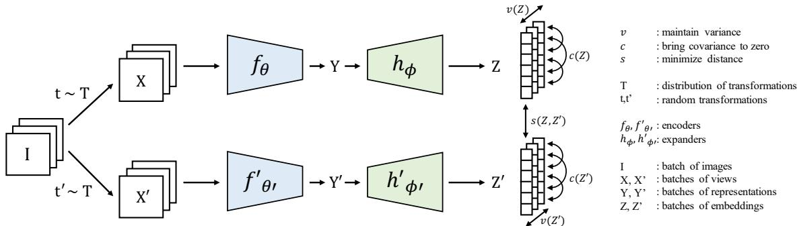

图 6：VICReg：惩罚方差、不变性和协方差项，以从未标记数据中学习表示。

我们也可以类似地掩码掉图像的一部分，并教导模型修复它们。这种预训练视觉策略被称为掩码图像建模（MIM）。受 BERT 启发，Dosovitskiy 等人利用视觉 Transformer 架构，掩码掉图块 token 并将其替换为学习到的掩码 token。然后他们教导模型直接预测像素值，但他们发现这种预训练策略的效果明显不如监督预训练。

Bao 等人 [2021a] 指出，将 BERT 策略直接应用于图像是困难的，因为文本 token 只能取少量值，可以作为分类问题来预测，而图像块可以取更多可能的值，因此类别数比适合分类的要多。相反，作者将 MIM 视为一个回归问题，首先使用自编码器将图像块编码为离散 token，然后预训练他们的 Transformer 来预测掩码 token 的离散 token 值。BEiT 在图像分类和语义分割等下游任务上取得了显著优于先前监督和自监督基线的性能，但其训练流程复杂，因为它需要一个强大的自编码器来将图像块转换为离散 token。

为了简化 MIM 预训练，两项并行的工作 [He et al., 2022, Xie et al., 2022] 分别提出了简化算法：掩码自编码器 (MAE) 和 SimMIM。与 BEiT 中从编码器提取离散图像词元不同，这些方法直接重建被掩码的图像块。此外，这些简化的预训练策略在下游图像分类、语义分割和目标检测任务上取得了优于 BEiT 的性能。此后，掩码图像建模在广泛的视觉任务 [Zhou et al., 2022a, Woo et al., 2023, Oquab et al., 2023] 乃至视觉-语言表示学习 [Fang et al., 2022a] 中都取得了具有竞争力的性能。在使用冻结编码器时最成功的方法，iBOT [Zhou et al., 2022a] 和 DINOV2 [Oquab et al., 2023]，采用了掩码图像建模与自蒸馏等更经典方法的混合。然而，它们的掩码图像建模目标是在潜在空间中重建，并使用教师网络提供目标，而非将原始图像作为重建目标。

考虑到 MIM 本质上是一项生成式建模任务。此类模型被训练为在观察到部分图像内容的条件下生成缺失的图像部分。请注意，BEiT、MAE 和 SimMIM 通过移除解码器并替换为预测头来部署到下游预测问题上。然而，掩码图像模型也能实现强大的生成式建模 [Chang et al., 2022]，包括文本条件生成 [Chang et al., 2023]。与顺序生成图块的图像自回归模型 [Yu et al.] 相比，基于 MIM 的生成模型效率显著更高，因为它们可以并行生成图块。

在第 3.6 节中，我们将讨论当前最优的掩码图像建模系统为达到如此具有竞争力的性能所采用的各种技术。

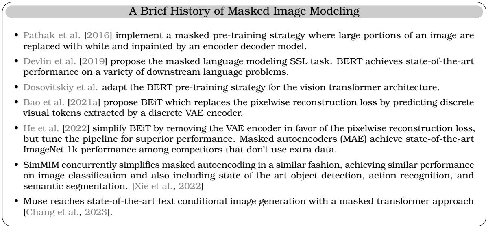

图 7: 掩码图像建模简史

## 2.6 自监督学习的理论统一

## 2.6.1 SSL 的理论研究

许多工作试图统一各种 SSL 方法。在 Huang et al. [2021] 中，Barlow Twins 准则被证明与对比损失的上界相关。这表明对比方法和基于协方差的方法之间存在联系。这一方向在 Garrido et al. [2022b] 中得到了进一步探索，其中通过推导两种方法之间的精确差距，证明了基于协方差和对比的准则在归一化后是等价的。这些结果在经验上也得到了进一步验证，因为方法在 ImageNet 规模（120 万样本）上表现出相似的性能和表示特性。方法之间的相似性也在 Tao et al. [2021] 中得到了研究，该工作从损失梯度的角度探讨了这种统一。

对比学习与其他目标之间的关系。最初，InfoNCE 被认为是两个视图之间互信息的变分近似 [Aitchison and Ganev, 2023, Wang and Isola, 2020, Oord et al., 2018]。Li et al. [2021a] 通过希尔伯特-施密特独立性准则 (HSIC) 的视角解释了 InfoNCE 在对比学习中的作用，该准则用于表示不同变换之间互信息 (MI) 的变分下界。Tschannen et al. [2020] 表明，InfoNCE 的性能不能仅用互信息来解释。相反，其他因素，如特征提取器和互信息估计器的公式，也很重要，并可能导致截然不同的性能 [Guo et al., 2022a]。其他理论表明，InfoNCE 平衡了“正”样本的对齐和整体特征表示的均匀性 [Wang and Isola, 2022]，或者（在强假设下）它可以识别假设数据生成过程中的潜在结构，类似于非线性 ICA [Khemakhem et al., 2020]。在 Wang and Isola [2020] 中，定理 1 表明，使用 RBF 核（一种将特征映射到高维空间的表达性映射）的对比学习收敛到球面上的均匀分布，并带有匹配对。[Tian, 2022] 表明，使用深度线性网络的对比学习等价于主成分分析 (PCA)，而 [Tian, 2023] 进一步分析了在使用对比损失训练时，架构中非线性所起的作用，表明非线性会导致许多局部最优解，这些最优解可以容纳训练数据中的多样化模式，而线性网络只能学习一个单一的主导模式。Hjelm et al. [2019] 引入了 Deep InfoMax (DIM)，它最大化深度神经网络编码器输入和输出之间的互信息，使用输入的局部特征，这一思想在 Veličković et al. [2018] 中被扩展到图。

统一的对比损失。Tian [2022] 将对比损失统一为最小化一个通用的损失函数族 $\mathcal { L } _ { \phi , \psi }$ ，其中 $\phi$ 和 $\psi$ 是单调递增且可微的标量函数。

$$
\operatorname*{min} _ { \theta } \mathcal { L } _ { \phi , \psi } ( \theta ) = \sum _ { i = 1 } ^ { N } \phi \left( \sum _ { j \ne i } \psi ( \| z _ { i } - z _ { i ^ { \prime } } \| _ { 2 } ^ { 2 } - \| z _ { i } - z _ { j } \| _ { 2 } ^ { 2 } ) \right) .\tag{15}
$$

其中 z 是表示，索引 i 和 $j$ 从 1 到 N。通过不同的 $\phi$ 和 $\psi$ ，公式 15 涵盖了多种损失函数（图 8）。特别地，设置 $\phi ( x ) = \tau \log ( \epsilon + x )$ 和 $\psi ( x ) = \exp ( x / \tau )$ 给出了 InfoNCE 损失 [Oord et al., 2018] 的广义版本：

$$
\mathcal { L } _ { n c e } : = - \tau \sum _ { i = 1 } ^ { N } \log \frac { e ^ { - \| z _ { i } - z _ { i ^ { \prime } } \| _ { 2 } ^ { 2 } / \tau } } { \epsilon e ^ { - \| z _ { i } - z _ { i ^ { \prime } } \| _ { 2 } ^ { 2 } / \tau } + \sum _ { j \neq i } e ^ { - \| z _ { i } - z _ { j } \| _ { 2 } ^ { 2 } / \tau } }\tag{16}
$$

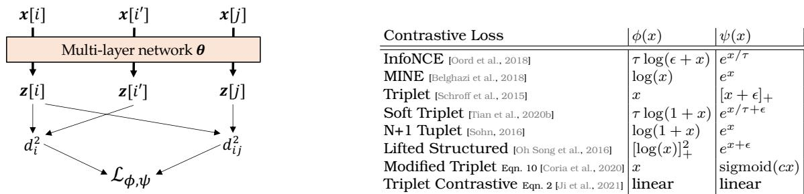

图 8: 问题设定。左图：数据点（第 i 个样本 x[i] 及其增强版本 x[i<sup>′</sup>]，第 j 个样本 $\pmb { x } [ j ] )$ ）被送入权重为 θ 的网络，以产生输出 z[i]、z[i<sup>′</sup>] 和 $z [ j ]$ 。从输出 z 中，我们计算 $d _ { i j } ^ { 2 }$ 和 $z [ i ]$ 之间的成对平方距离 $z [ j ]$ ，以及 $d _ { i } ^ { 2 }$ 和 $z [ i ]$ 之间的类内平方距离 $z [ i ^ { \prime } ]$ ，用于使用通用对比损失族 $\mathcal { L } _ { \phi , \psi }$ （公式 15）进行对比学习。右图：不同的现有损失函数对应于不同的单调函数 $\phi$ 和 ψ。这里 $[ x ] _ { + } : = \operatorname*{max} ( x , 0 )$

其中 $\epsilon > 0$ 是某个常数，例如 He et al. [2020b], Tian et al. [2020a] 中使用了 ϵ = 1，$\epsilon = 0$ 产生了 SimCLR [Chen et al., 2020b] 的轻微变体，即 DCL 损失 [Yeh et al., 2021]。

困难负样本采样。负样本挖掘在（深度）度量学习中已被深入研究。最近，一些工作专注于对困难样本赋予更大权重 [Robinson et al., 2020]。然而，Kalantidis et al. [2020], Tian [2022] 表明，具有 $\psi = e ^ { x / \tau }$ 的对比 SSL 损失在批次级别已经具有这种机制，无需显式的“困难负样本采样”即可关注困难负样本对。这意味着对比损失需要大批量大小以确保观察到困难负样本，这会带来额外的内存成本。

投影器的研究。投影器网络由 Chen et al. [2020b] 首次引入，它将表示映射到另一个空间，并在该空间中计算损失。尽管有强有力的经验证据表明投影器能提升性能，但很少有理论工作试图解释其作用。Jing et al. [2022] 研究了线性投影器在对比学习中的作用。更准确地说，他们认为投影器防止了表示空间中的维度坍缩，并且只需要是对角且低秩的即可实现此目的。尽管所提出的无投影器方法优于带有一层线性投影器的 SimCLR，但对于 2 层和 3 层 MLP 投影器，其性能仍无法企及。Cosentino et al. [2022] 研究了当数据增强是李群变换时，投影器和数据增强之间的相互作用，并且像 Mialon et al. [2022] 一样，对投影器的宽度和深度的影响提供了解释。关于投影器作用的进一步实证研究将在第 3.2 节中介绍。

## 2.6.2 表示的维度坍缩

虽然联合自监督方法的目标是学习有意义的表示，但很大一部分方法都遭受着所谓的维度坍缩问题。

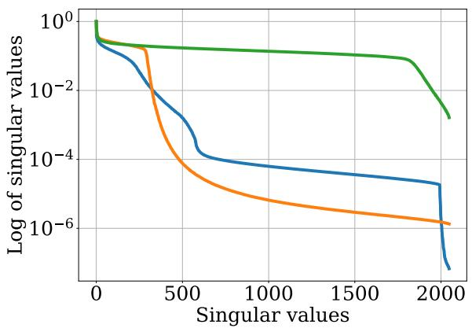

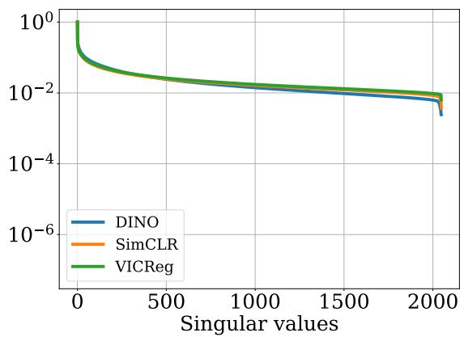

图 9: 投影器之前（左）和投影器之后（右）的维度坍缩示意图。方法在投影器后遭受不同程度的坍缩；而投影器之前的表示则没有发生这种坍缩。

当表示的不同维度编码的信息冗余时，就会发生维度坍缩。换句话说，在投影器的输出中，嵌入是秩亏的，这可以通过嵌入的奇异值谱来近似，如图 12 所示。

这一现象首先由 Hua et al. [2021] 说明，其中使用白化批归一化有助于缓解坍缩。Jing et al. [2022] 也从理论角度研究了维度坍缩，重点关注对比方法。随后的几项工作将维度坍缩与对性能的影响联系起来 [He and Ozay, 2022, Ghosh et al., 2022, Li et al., 2022a, Garrido et al., 2022a]。一些工作专注于无监督评估 [Ghosh et al., 2022, Garrido et al., 2022a]，其中发现维度坍缩是下游性能的一个良好代理指标。

已经引入了不同的维度坍缩度量，例如奇异值分布的熵 [Garrido et al., 2022a]、经典秩估计器 [Jing et al., 2022]、对奇异值分布拟合幂律 [Ghosh et al., 2022] 或奇异值分布的 AUC [Li et al., 2022a]。尽管如此，所有这些度量都侧重于评估表示的秩，以衡量学习表示中的维度坍缩。

## 2.7 预训练数据

精选（标准）：最常见的做法是在精选数据集（如 ImageNet）和替代数据集（如 PASS [Asano et al., 2021]）上预训练 SSL 模型。这些数据集通常类别平衡，并包含以物体为中心的图像，其中物体通常突出地出现在照片中心。

使用野外数据进行训练：尽管 ImageNet 一直是预训练的首选数据集，但它绝非唯一选择。其简单性（以物体为中心、单一物体、类别平衡）使其成为一个非常好的试验场，但大多数野外数据集并不那么干净。如果我们想利用大型非精选数据集，SSL 方法需要能够在 ImageNet 之外很好地迁移。为此，一些工作探索了在大型非精选数据集 [Goyal et al., 2021] 或与 ImageNet 不同的数据集（如 COCO [El-Nouby et al., 2021] 或 iNaturalist [Assran et al., 2022a]）上进行预训练。尽管这些工作显示了有希望的结果，但 ImageNet（或类似精选数据集）预训练仍然是常态。

| 目标数据集 / 方法 | iNaturalist18 / VICReg | iNaturalist18 / SimCLR | iNaturalist18 / DINO | iNaturalist18 / MSN | Places205 / VICReg | Places205 / SimCLR | Places205 / DINO |
| --- | --- | --- | --- | --- | --- | --- | --- |
| ImageNet 预训练 | 38.8 | 39.2 | 46.3 | 40.5 | 52.6 | 51.8 | 54.4 |
| 目标数据集预训练 | 37.0 | 28.6 | 41.9 | 29.1 | 53.4 | 51.6 | 57.2 |

表 1: 通过在 ImageNet 上预训练或直接在目标数据集上预训练，在目标数据集上的 top-1 准确率比较。我们使用最初在 ImageNet 上开发的相同数据增强策略来研究其可迁移性，并大量调整了损失相关的超参数。所有方法在所有数据集上都以相同的迭代次数进行预训练。

为了提供其他见解，我们在 Places205 [Zhou et al., 2014] 和 iNaturalist18 [Horn et al., 2018] 上预训练了方法，没有改变增强策略，但大量调整了损失相关的系数。目的是看在 ImageNet 上使用的设置是否能很好地迁移到其他数据集。Places205 的优势在于不以物体为中心，而 iNaturalist 则具有类别的幂律分布以及需要大量细粒度信息的特点。我们在表 1 中报告了结果。正如我们所看到的，大多数方法在 ImageNet 或目标数据集上预训练时都能达到相似的性能。这表明在 ImageNet 上开发的协议可以很好地迁移，因为我们注意到在 ImageNet 上最优的超参数在其他数据集上也往往是最优的。不过有一个明显的例外，SimCLR 和 MSN 在直接于 iNaturalist18 上预训练时表现不佳。虽然这里无法得出精确的结论，但这表明某些方法对预训练数据集的敏感性高于其他方法。

弱精选训练数据：利用大型非精选数据集的一个成功方法是基于精选数据在其中进行检索。这意味着该数据集将包含与精选或较小的源数据集（如 ImageNet）相似的图像，同时规模更大、更多样化。此策略在 DINOv2 [Oquab et al., 2023] 中使用，其中 LVD-142M 是使用各种小型和特定领域数据集构建的。虽然这不会在 ImageNet 分类上带来大的性能提升，但可以在其他任务（如图像检索）上带来显著的性能提升。

## 3 成功进行 SSL 训练和部署的实用指南

## 3.1 数据增强的作用

许多 SSL 方法，特别是源自 Chen et al. [2020b] 的联合嵌入方法，需要一种方法来从给定图像定义正视图以学习不变性。这些 SSL 方法中使用的代理是利用数据增强来定义这些不变性。例如，通过使用给定图像的不同裁剪作为正视图，SSL 模型将被训练为产生对这些不同裁剪不变的表示。当使用灰度操作或颜色抖动操作作为正视图时，表示将必须对颜色信息保持不变。因此，SSL 模型所学内容的深层本质是由数据增强流水线定义的。值得注意的是，由于投影器 [Bordes et al., 2022a] 的存在，并未实现完美的不变性，这有助于提高在并非完全不变的任务上的性能。Chen et al. [2020b] 研究了特定数据增强对 SimCLR 在 ImageNet 上性能的影响程度。他们表明，噪声等较简单的数据增强对下游 ImageNet 分类没有益处。相反，裁剪和多种颜色抖动操作带来了与有监督基线相竞争的结果。数据增强这一关键元素在后续的 SSL 工作 [Chen et al., 2020d, Bardes et al., 2021, Zbontar et al., 2021] 中也得到了广泛应用，没有显著变化。唯一有时使用的变体是在学习不变性时，除了较大的裁剪外，还添加较小的裁剪。我们将在接下来的小节中讨论这种使用大、小裁剪的方法，称为多裁剪。

然而，这种特定的数据增强组合是专门为在 ImageNet 上取得良好性能而设计的。Bordes et al. [2023a] 研究了不同数据增强选择对不同下游任务的影响，发现即使添加 ColorJitter 似乎对许多分类任务有益，但在其他下游任务上可能并非总是如此。类似地，Ericsson et al. [2021a] 表明，不同的增强会导致学习不同类型的不变性，其中一些不变性在某些下游任务上优于其他任务。作者建议合并使用不同增强学习到的表示，以提高在更广泛下游任务上的可迁移性。使用复杂的数据增强流水线也存在一个隐藏成本：数据预处理时间可能会显著减慢训练速度。因此，当训练预算重要时，在训练 SSL 模型时可能更倾向于仅使用随机裁剪和灰度操作。我们将在第 3.8.1 节讨论加速训练流水线的常见方法。Ni et al. [2021b] 进一步表明，当明确训练对比学习器不对其保持不变时（如在元学习中 [Ni et al., 2021a]），它们可以从非常激进的数据增强（如大角度旋转）中受益。

另一条工作线试图消除对这些手工设计的数据增强的需求。一种方法是使用基于重建的目标，如 MAE [He et al., 2022]，它在像素空间中使用重建损失，以避免定义精确不变性的需要。另一种方法基于联合嵌入，其中基于图像的随机部分，目标是预测图像缺失部分在表示空间中的表示。此类方法的一个例子是 I-JEPA [Assran et al., 2023] 或 Data2Vec2.0 [Baevski et al., 2022]，它们使用图像的上下文部分来预测图像缺失的小部分。另一条工作线试图保留关于增强的风格信息，通过预测风格信息 [Xiao et al., 2020, Dangovski et al., 2021, Gidaris et al., 2018, Scherr et al., 2022] 来提高需要风格信息（如颜色）的下游任务的性能。编码对增强的真实等变性（这需要嵌入之间的映射）是一个活跃的研究方向，方法包括 EquiMod [Dangovski et al., 2021]、SEN [Park et al., 2022] 或 [Marchetti et al., 2022]，这些方法也旨在将表示拆分为类别和姿态。这种将表示拆分为不变和等变部分的思想也在 SIE [Garrido et al., 2023] 中进行了探索，并在 Ibrahim et al. [2022] 中使用了李群形式。

## 3.1.1 多裁剪的作用

虽然像 MoCo [Meng et al., 2021] 这样的工作侧重于增加负样本对的数量或质量，但提升性能的另一个方向是增加给定图像的正样本数量。SwAV [Caron et al., 2020] 引入的多裁剪策略通过在通常的两个大裁剪（224 × 224）基础上增加较小的裁剪（96 × 96）来解决这个问题。该方法并非仅比较两个大裁剪或所有裁剪对，而是将两个大裁剪分别与所有其他裁剪（无论大小）进行比较。因此，如果有 2 个大裁剪和 N 个小裁剪，不变性损失将被计算 2(N − 1) 次，从而增加了正样本对相关的信号。使用较小的裁剪以及不比较所有裁剪对，有助于降低这些额外裁剪的计算成本。虽然额外裁剪的数量可能不同（Mugs [Zhou et al., 2022b] 中为 10 个，而 SwAV 中为 6 个），但如果直接使用，总会导致训练时间和内存使用的增加。为了缓解这一成本，SwAV 中使用 160 × 160 的大裁剪和 4 个 96 × 96 的小裁剪有助于缓解内存成本，与使用两个 224 × 224 裁剪的经典设置相比，仅导致训练时间增加 25%，同时性能提升了 4 个百分点。因此，多裁剪是一种非常有用的策略，可以以微小的额外计算成本来提升性能。它因此在近期工作中几乎无处不在 [Caron et al., 2021, Zhou et al., 2022a,b, Bardes et al., 2022, Oquab et al., 2023]。值得指出的是，一些工作仅注意到性能有微小提升 [Wang et al., 2021a]，其中它仅带来了 0.3 个百分点的性能提升。

其他方法通过使用嵌入空间中的最近邻来消除向编码器输入额外裁剪的计算负担。在 NNCLR [Dwibedi et al., 2021] 中，匹配的正样本裁剪被其在潜在空间中的最近邻替换；而在 MSF [Koohpayegani et al., 2021] 中，在嵌入空间中构建了一个 k-NN 图，以提供类似于多裁剪的效果并增加正样本对相关信号。该策略在 UniVCL [Tang et al., 2022] 中得到了进一步应用，该方法结合了诸如节点边缘掩码等增强策略与潜在空间中的 k-NN 图。所有这些方法相比多裁剪，都以更小的计算成本显示出显著的性能提升。在 MSF 中，使用这种 k-NN 图仅使训练时间增加了 6%。

## 3.2 投影器的作用

大多数采用联合嵌入方法的自监督学习（SSL）在编码器之后都包含一个投影器（通常是 2 层或 3 层的带 ReLU 的多层感知机）。SSL 损失应用于投影器的输出，并且投影器通常在训练后被丢弃。这个关键组件在 SimCLR [Chen et al., 2020b] 中被引入，虽然它并非负责避免坍塌，但允许在 ImageNet 上获得显著的 top-1 准确率提升。例如，在 100 轮训练中，投影器在 SimCLR 和 VICReg 中增加了大约 20% 的 top-1 准确率（分别从约 50% 提升到 68% 和从 48% 提升到 68%）。

Bordes 等人 [2022a] 表明，添加投影器不仅对 SSL 有用，而且在训练任务与下游任务不一致的监督训练设置中也高度有益（Sariyildiz 等人 [2022] 也证明了这一点）。事实上，从 Yosinski 等人 [2014] 的研究中众所周知，在已训练的深度神经网络中裁剪层在进行迁移学习时是有益的，主要是为了避免训练任务的过拟合偏差。从迁移学习的角度来看，就很容易理解为什么 SSL 中需要投影器，因为训练任务总是与下游任务不同。为了弥合 SSL 和迁移学习文献中使用的术语之间的差距，Bordes 等人 [2022a] 建议将探测中间表示或裁剪层的方法命名为：断头台正则化（GR）。他们还强调了将 GR 与 SSL 中添加投影器区分开来的重要性，因为探测表示的最佳层可能并不总是主干网络（但可能是中间投影器层，如 Chen 等人 [2020c] 所证明的）。最后，Bordes 等人 [2022a] 证明，减少训练任务与前置任务之间的不一致性（通过在对比学习中使用类别标签来寻找正样本对）会导致学习到一个网络，其在 ImageNet 上的最佳线性探测性能在最后一个投影器层获得（而不是主干网络），如图 10 所示。

| 投影器 | 预言机 | Top-1 | Top-5 |
| --- | --- | --- | --- |
| X | X | 50.1 | 75.8 |
| X | V | 56.4+6.3 | 80.2 |
| V | X | 68.9 | 88.2 |
| V | V | 69.5+0.6 | 88.8 |

表 2：投影器可以处理源自随机数据增强的噪声。在没有投影器的情况下训练 VICReg，可以通过使用预言机过滤语义不一致的增强视图而受益。使用投影器后，使用预言机仅带来微小的增益。Top-1 和 Top-5 对应于在 IN-1k 上的线性探测性能。

**使用投影器处理有噪声的图像增强。** 投影器可能对于减轻数据增强的噪声也是必要的。如第 3.1 节所述，SSL 方法通常随机增强输入图像以生成同一图像的两个不同视图。在某些情况下，对两个非常不同的视图强制执行不变性可能是一个非常强的约束，可能会损害性能，例如当两个视图的内容不同时。为了演示使用投影器如何缓解这个问题，我们使用根据“预言机”（例如，在 ImageNet 上完全监督预训练的 ResNet50）判断为语义相似的图像增强，来预训练带和不带投影器的 VICReg [Bardes et al., 2021]。我们预训练 100 轮，并将这些实验的线性探测结果包含在表 2 中。在没有投影器但有预言机的情况下，Top1 性能比不使用预言机高 6.3%。然而，配备了投影器后，使用预言机去除噪声视图仅将 Top1 性能提升了 0.6%。这可能意味着投影器在 SSL 训练过程中处理不一致或有噪声的增强视图方面发挥作用。

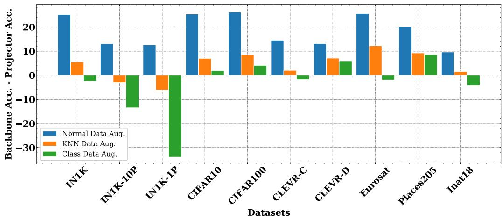

图 10：来自 Bordes 等人 [2022a] 的图表，显示了在多个下游任务中主干网络和投影器表示之间的准确率差异。当使用传统的 SSL 正样本对（蓝色）时，主干网络的准确率总是远高于投影器。然而，当使用类别标签信息来定义正样本对（绿色）时，从而减少了训练任务与下游任务之间的不一致性，投影器表示在 ImageNet 上比主干网络表示获得了更高的准确率。

**投影器输出维度的影响。** 类似于大批量大小被视为对比方法的必要条件，投影器的大输出维度被视为基于协方差方法的必要条件。这由 Zbontar 等人 [2021] 的图 4 和 Bardes 等人 [2021] 的表 12 说明，其中在 ImageNet 上观察到了高达 15% 的 top-1 下降。正如 Garrido 等人 [2022b] 所指出的，这是由于投影器的中间层随输出维度缩放，以及损失权重也需要缩放。通过调整这些参数，VICReg 在 256 维嵌入下的 top-1 准确率从 55.9% 增加到 65.1%。峰值性能也在 1024 维度达到，之后趋于平稳。虽然 VICReg 对投影器输出维度的敏感性仍然高于 SimCLR，但它比最初认为的要稳健得多，并且非常大的输出维度并非必要条件。由于 Barlow Twins 与 VICReg 方法之间的相似性，应该可以获得可比较的结果。

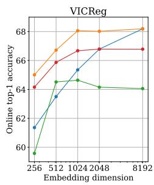

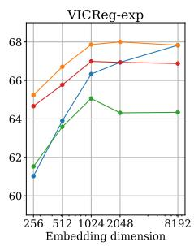

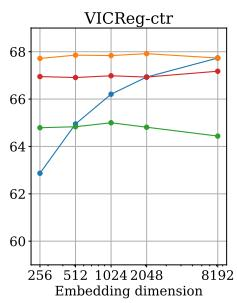

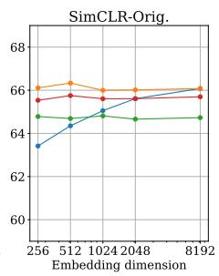

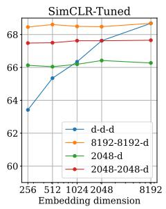

图 11：不同投影器架构和输出维度对流行方法的影响。$x - y - z$ 表示一个多层感知机，其各层输出维度分别为 x、y 和 z。来自 Garrido 等人 [2022b]。

**主干网络输出维度的影响。** 近期工作也研究了主干网络维度的影响。Dubois 等人 [2022] 观察到，在使用 CISSL 时，更大的主干网络表示会导致更好的线性探测性能。Bordes 等人 [2023b] 更深入地研究了主干网络维度对常见 SSL 方法（如 VICReg、SimCLR 或 BYOL）的影响。他们表明，当主干网络维度增加时，传统的监督方法性能会下降。另一方面，SSL 方法从更宽的主干网络表示中获益良多，如图 12a 所示。事实上，在 SSL 中，训练 ResNet 时增加主干网络的大小比增加 ResNet 的宽度或深度更有益，如图 12b 所示。这一观察结果突显了当前 SSL 中使用的架构（通常与监督训练中使用的架构相同）可能并非最优。

**投影器诱导的表示特性。** Mialon 等人 [2022] 认为，投影器强制实现了表示中特征的成对独立性，并为 VICReg、BarlowTwins 和 W-MSE [Bardes et al., 2021, Zbontar et al., 2021, Ermolov et al., 2021] 上下文中的随机投影器提供了证明。特别是，更宽的投影器可以达到更高程度的独立性。对于从“真实世界”数据集（如 ImageNet）学习无监督表示，成对独立性（或其软概念）可能比相互独立性 [Li et al., 2019] 更合适。或者，如果需要相互独立性，则需要寻求替代 VCReg 的 SSL 正则化。在投影器输出处应用 VCReg（VICReg 中的抗坍塌项）所产生的优化动态也值得注意：最小化关于投影器参数的 VCReg 并非必要，而 VCReg 更倾向于关于编码器参数进行优化。这种分析是否完全适用于其他 SSL 方法仍是一个开放性问题。

**无投影器训练 SSL。** Jing 等人 [2022] 提出了 DirectCLR，表明通过在没有可训练投影器的情况下，对表示的子向量应用 InfoNCE SimCLR 目标来正则化表示，足以在 ImageNet top-1 准确率方面超越带有线性投影器的 SimCLR。

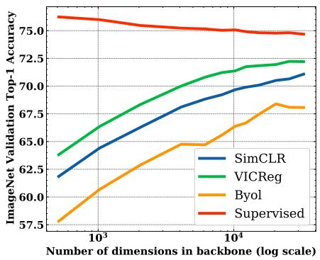
(a)

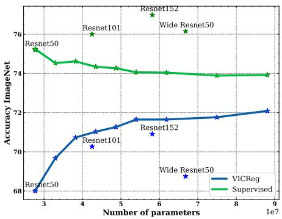
(b)
图 12：来自 Bordes 等人 [2023b] 的图表。a) 各种 SSL 方法在 ImageNet 上的准确率与主干网络输出维度的关系。b) ImageNet 准确率与参数数量的关系。蓝色和绿色线上的点是针对不同主干网络输出维度训练的模型。

## 3.3 SSL 中的均匀先验或 SSL 在不平衡数据上的失败

尽管 SSL 方法近期取得了成功，但它们存在一个重要局限性：在不平衡数据集上性能不佳。由于现实世界的数据是不平衡的，这一局限性是使得 SSL 方法在大量未整理数据上的应用具有挑战性的一个重要因素。Assran 等人 [2022a] 通过使用许多 SSL 方法共有的隐藏均匀先验来解释这一局限性。通过将数据均匀分布在表示空间中，SSL 方法学习在给定小批量中找到最具判别性的特征。当数据在类别标签上均匀分布时，模型将学习到的最具判别性特征将是类别特定的。然而，当使用不平衡数据时，小批量内最具判别性的特征可能不再是类别，而是更底层的信息，这会降低下游分类任务的性能。为了缓解这个问题，Assran 等人 [2022a] 在 SSL 方法 MSN [Assran et al., 2022c] 上引入了一个额外的正则化项，以改变 SSL 聚类的分布。

## 3.4 教师-学生架构特定技巧

## 3.4.1 移动平均教师的作用

虽然原始的 BYOL 方法基于对目标（教师）网络权重的指数移动平均（EMA）更新，但后来证实 EMA 并非必需（即在线网络和目标网络可以相同）。SimSiam [Chen and He, 2021] 也证实了这一点，只要预测器更新更频繁或相对于主干网络有更大的学习率。在 DQN 的情况下，带有 EMA 的目标网络被证明可以消除偏差 [Fan et al., 2020]，而 Piché 等人 [2021] 表明，通过使用正确的正则化器，可以从目标网络中移除 EMA。对于 BYOL，在线网络的停止梯度（意味着目标网络的衰减率为 0）会导致坍塌，如 Grill 等人 [2020] 的表 5 所示。Pham 等人 [2022] 表明，指数移动平均的思想提供了训练稳定性，甚至可以用于非师生框架，如 SimCLR。具体来说，他们表明对 SimCLR 的投影器应用 EMA 更新可以提升性能。Wang 等人 [2022c] 表明，训练也可以从师生设置中的其他类型不对称性中受益（例如，在学生侧使用更强的增强）。

## 3.4.2 自标记 SSL 中预测器的作用

预测器网络在 BYOL 的成功中扮演着核心角色，它从学生网络的表示预测教师网络的表示。Shi 等人 [2020] 表明，移除预测器会导致 ImageNet 上的 top-1 准确率从 68% 下降到 21%（与 BYOL 中原始的两层 MLP 预测器相比）。在 Shi 等人 [2020] 的图 1 中，他们证明即使是线性预测器也能带来良好的性能，并且可以在 10-20 轮训练中从较差的初始化恢复。对于 SimSiam，Chen 和 He [2021] 的表 1 表明，移除 SimSiam 中的预测器也会导致坍塌，ImageNet 上的 top-1 准确率低于 1%。Tian 等人 [2021]（其实现可在<sup>2</sup>找到）证明，在存在预测器的情况下，BYOL 和 SimSiam 的训练动态包含非平凡的稳定不动点，从而避免在训练期间陷入平凡解，即使这些平凡解是全局最优的。该工作进一步提出了一种对比方法 DirectPred，该方法在训练期间通过特征值分解直接设置预测器，并在 ImageNet 上取得了可比的性能。其后续工作（DirectSet [Wang et al., 2021b]）进一步消除了特征值分解的开销。

## 3.5 标准超参数的作用

SSL 研究中的一个常见问题是每种方法都有不同的超参数配置。因此，直接比较不同的 SSL 方法或模型通常具有挑战性。在本节中，我们介绍并描述每个超参数的影响，以帮助 SSL 从业者根据其设置确定哪些最重要。

## 3.5.1 小批量大小的影响

最初人们认为，像 SimCLR 或 MoCo 这样的对比方法需要大批量大小或存储库才能工作。事实证明这是误导性的，因为这两种方法都可以在小批量大小下工作。Chen 等人 [2020b] 的附录中讨论了学习率的平方根缩放，对于 100 轮训练，这已经在 ImageNet 上带来了高达 5 个百分点的 top-1 准确率提升。

类似地，Bordes 等人 [2023a] 研究了小批量大小下学习率的影响，并发现了如何在不显著降低性能的情况下，使用单个 GPU 在 ImageNet 上训练 SimCLR。此外，一些工作如 DCL [Yeh et al., 2021] 表明，通过简单地从 softmax 的分母中移除正样本对并进行更仔细的超参数调整，可以在 SimCLR 中使用 256 或更大的批量大小，在 MoCo 中使用仅 256 或更大的队列大小达到顶级性能。类似地，Zhang 等人 [2022a] 表明，通过分解 MoCo 中的字典并使用不同的温度参数用于正负样本对，可以增加对字典维度的鲁棒性。

## 3.5.2 学习率（调度器）和优化器的作用

这里我们概述各种方法中学习率调度器和优化器的典型标准设置。为了确定学习率，方法通常根据 Goyal 等人 [2017] 的启发式规则，基于批量大小缩放基础学习率：学习率 $= { \frac { \mathrm { b a t c h ~ s i z e } } { 2 5 6 } }$ ∗ 基础学习率。对于 ImageNet 预训练，VICReg、Barlow Twins、BYOL 和 SimCLR 使用基础学习率 0.2 − 0.3 配合 LARS 优化器 [You et al., 2017]。此外，对于某些方法如 Barlow Twins，使用更小的学习率（0.0048）来更新偏置项和批归一化参数。其他方法如 MAE、DINO 和 iBot 使用 AdamW 优化器 [Loshchilov and Hutter, 2017] 配合较小的基础学习率 $1 e - 5 - 5 e - 4$。关于权重衰减的讨论见第 3.5.3 节。最常见的训练计划包括一个预热期，通常为 10 轮，在此期间学习率线性增加到其基础值。预热期之后，大多数方法使用余弦衰减。

## 3.5.3 权重衰减的作用

权重衰减是许多 SSL 方法反向传播中的一个重要组成部分。BYOL [Grill et al., 2020] 中的表 15 表明，没有权重衰减可能导致不稳定的结果。最近的一篇博客文章<sup>3</sup>也提到，在 BYOL 中使用权重衰减可以实现稳定的学习。在 Tian 等人 [2020b] 的图 4 中，权重衰减的效果被解释为对初始条件记忆的影响。其假设是，权重衰减允许在线网络和预测器更好地对增强的不变性进行建模，而不管初始条件如何。如需进一步阅读，Zhang 等人 [2022b] 对 SimSIAM 坍塌的理解提供了很好的综述，Shi 等人 [2020] 对 BYOL 做了同样的工作。

## 3.5.4 Vision Transformer 注意事项

训练 Vision Transformer (ViT) [Dosovitskiy et al.] 需要特别小心。它们更容易发生坍塌和不稳定，并且对超参数的设置更敏感 [Touvron et al., 2021a]。

批大小。[Chen et al., 2021b] 发现，联合嵌入 ViT 自监督学习方法的大批量（例如 4096）训练可能不稳定。这种不稳定性不会表现为最终准确率的大幅下降，而是在训练过程中当梯度 $L _ { \infty } - n o r m$ 出现尖峰时，表现为 kNN 探针准确率的下降。使用随机（而非学习到的）图块投影层将像素图块嵌入为 ViT 的输入 token，可以稳定 MoCo-V3、SimCLR 和 BYOL 的训练，并提高最终准确率。10k 次迭代的学习率预热期 [Goyal et al., 2017, Dosovitskiy et al.] 也能提高训练稳定性。另一方面，Caron et al. [2021] 指出，当使用非常小的批大小（128）进行训练时，最终 k-NN 准确率会下降。因此，对于 ViT 的自监督学习预训练，1024 或 2048 的批大小似乎是理想选择。

虽然 ViT 架构没有任何批归一化层，但在投影头中使用批归一化层训练 MoCo-V3 模型提高了 ViT 的线性探针准确率 [Chen et al., 2021b]。请注意，对于联合嵌入方法，批处理可以同时对所有样本和裁剪块在一个批次中进行，也可以对每个裁剪块批次分别进行。SimCLR 采用前者，而 BYOL 和 MoCo-V3 采用后者。

**图块大小。** [Caron et al., 2021] 发现，使用更小的图块大小 $( 5 \times 5 ,$ $\phantom { - } 0 \mathbf { r } 8 \times 8$ 代替 $1 6 \times 1 6 )$ 进行训练，可以提高 DINO ViT 预训练的线性探针准确率。请注意，虽然增加图块大小会减少运行时间，但也会增加内存使用量（这使得在小于 $8 \times 8 )$ 的图块上训练变得困难）。

**随机深度** [Huang et al., 2016] 起源于自然语言处理，随后被用于视觉模型 [Touvron et al., 2021b] 以训练更深的模型。它随机丢弃 ViT 的块作为正则化手段。每层的丢弃率可能线性依赖于层深度，或者如近期工作 [Touvron et al., 2021b] 所建议的那样是均匀的。这在训练更大模型（ViT-L, ViT-H 等）时非常重要。例如，Touvron et al. [2022] 对 ViT-H 模型使用了 0.5 的丢弃路径率。相反，当训练像 ViT-B 这样较小的模型时，这种正则化通常会损害性能 [Steiner et al., 2021]。

**层衰减** [Clark et al., 2020] 沿各层几何级数地降低学习率。换句话说，最后一层不受影响，而第一层具有非常小的学习率。在自监督学习视觉模型中，层衰减在下游任务微调时提高了性能 [Bao et al., 2021b, Zhou et al., 2022a, He et al., 2022]。根据模型大小，该参数设置在 0.65 到 0.85 之间——较大的模型通常需要更高的值，因为层数更多。其基本原理是自监督学习构建了强大的模型主干，因此我们只需要微调最浅的层。

**层缩放** [Touvron et al., 2021b] 是对 Transformer 每个残差块产生的向量进行逐通道乘法。它增加了优化的稳定性，并允许更深的 ViT（大于 ViT-B）。

**[cls] token。** 当方法没有明确需要时，使用图块 token 的平均值代替类别 token 可以节省内存，而网络的准确率变化不大 [Zhai et al., 2022a]。

## 3.6 高性能掩码图像建模技术

虽然有几种掩码预训练方法，但采用这些方法的最优系统倾向于将掩码图像建模与其他技术相结合。例如，发布时在 ImageNet（仅使用公开数据训练的模型）上达到最优的 ConvNextV2 架构采用了 MAE 预训练 [Woo et al., 2023]。有趣的是，作者指出，简单地使用 MAE 框架预训练 ConvNextV2 效果不佳。他们提出添加一种名为“全局响应归一化”的新型归一化层，这对达到最优结果至关重要 [Woo et al., 2023]。

在其他声称在图像分类和语义分割上达到最优性能的工作中，掩码图像建模预训练与蒸馏相结合。虽然一些掩码图像建模流程涉及在像素空间重建输入的掩码部分，但另一种选择是使用教师网络生成未掩码图像的目标表示。Zhou et al. [2022a] 提出了 iBOT，它在基于蒸馏的掩码图像建模中同时使用 ViT 作为教师和学生，并在 ImageNet 分类上优于先前方法。随后，Liu et al. [2022b] 提出了 dBOT，这是一种更新的基于蒸馏的掩码图像建模方法，也在图像分类和语义分割上取得了最优结果。他们工作的一个主要发现是，如果分阶段进行蒸馏，则不必精心选择教师模型。即定期更新教师以匹配学生权重，并重新初始化学生。Oquab et al. [2023] 采用类似的蒸馏方法，从 ViT-g 教师训练出性能远优于从头训练的较小模型。这一系列工作强调了将蒸馏与掩码图像建模结合是非常有效的。

对于利用掩码图像建模超越先前工作的目标检测器，允许掩码图像建模与像 Swin 这样近期高性能的金字塔 ViT 协同工作的技术至关重要。由于金字塔 ViT 会合并图块，随机掩码可能导致某些局部窗口没有信息。Li et al. [2022d] 提出了一种考虑这些模型层次结构的掩码方法，称为“均匀掩码”。他们限制掩码在每个局部窗口中隐藏等量的信息，确保每个窗口都有一些信息保持完整。这项技术帮助自监督模型（在 ImageNet1K 上）在目标检测基准上超越了监督模型（甚至在 ImageNet22K 上）[Li et al., 2022d]。

## 3.7 评估你的自监督学习模型

## 3.7.1 使用标签进行评估

自监督预训练主要在图像分类上进行评估，因为图像分类几十年来一直是计算机视觉的核心。三种主要的通用协议是 k 近邻、线性评估和全微调评估（按复杂度排序）。它们是离线评估，意味着它们独立于自监督训练过程进行，与在线评估（在训练期间进行）相反。虽然在线评估可以提供下游性能的有用信号，但由于它与变化的自监督学习目标一起优化，可能会产生误导。此外，对于这些需要下游任务标签的流程，最近，RankMe [Garrido et al., 2022a] 已成为昂贵评估的可行替代方案，并作为最终准确率的预测指标，无需进行任何训练。

**KNN** 是机器学习中最著名的算法之一，并在各个领域得到广泛应用。对于图像分类，KNN 分类器根据数据点邻居的标签来确定其标签。

正式地说，首先使用模型从训练数据集中的所有图像中提取冻结特征 $\mathcal { X } = x _ { 1 } , . . . , x _ { n }$（通常是 $l _ { 2 } { \mathrm { - n o r m a l i z e d } } )$）。为了分类新图像，我们提取其特征表示 $x ^ { \prime }$，并检索其 k 个最近邻。它们是训练集 X 中与 $x ^ { \prime } .$ 具有最高余弦相似度的 k 个向量。然后，朴素方法应用多数投票方案：每个邻居在其对应标签中计数 +1，最后选择得票最多的标签。更复杂的方法使用加权投票方案。每个邻居不是在其对应标签中计数 +1，而是计算一个权重 $w = f ( x ^ { T } x ^ { \prime } )$，例如 DINO 实现采用 $w = e ^ { x ^ { T } \bar { x } ^ { \prime } / T }$ [Caron et al., 2021]。这允许处理不平衡的训练集和非独立同分布的特征，并且通常能给出更准确的结果，代价是引入了一个额外的超参数 $T$。

K-NN 分类器具有不依赖许多超参数、部署快速轻量且无需任何领域适应的巨大优势。

**线性** 在自监督学习评估的背景下，在预训练特征表示之上训练线性分类器，即线性探针评估，由 Zhang et al. [2016, 2017] 引入。它是最流行的协议，原因如下：它实现了高准确率；其性能高度依赖于表示的质量，因为其判别能力较低；它模仿了特征在实践中如何使用；最后但同样重要的是，它的计算成本不高。

大多数情况下，只需在冻结的主干网络末端附加一个线性层，并优化其参数几个轮次（大约 100 轮）。有时，如 Bao et al. [2021b] 所介绍的，我们可以利用线性评估轻量级的特点，同时评估多个线性头，以同时测试许多超参数（学习率、平均特征或对类似 ViT 架构使用类别 token、特征数量等）。线性探针也可以在线训练，只需从表示中截断梯度。虽然只是一个近似，但在线线性探针非常廉价，因为它重用了自监督学习预训练的计算，并给出了下游性能的良好指示，如图 13 所示。

**MLP** 除了简单的线性探针，还可以使用多层感知机（两层或三层）来提取自监督学习模型中学习到的信息。非线性评估在自监督学习相关工作中很少出现，然而当学习到的特征不是线性可分的，并且难以用线性模型提取特征中的信息时，它是必需的。事实上，比较线性和非线性探针的结果，可以让我们了解表示的结构化程度。Bordes et al. [2023a] 展示了一些比较使用线性或非线性探针的不同评估机制的结果。在图 13 中，可以观察到使用多层感知机代替线性探针可以在准确率上获得一些提升。然而，向探针增加容量的主要问题与过拟合有关：最佳的 MLP 头可能不是 100 个轮次后得到的那个，如图 13 所示。

**全微调** 掩码自编码器论文 [He et al., 2022] 重新引入了微调作为主要的评估指标。主要论点是线性探针与微调和迁移学习性能不相关，并且小的 MLP 头不能评估方法创建强大但非线性特征的能力。随后的大多数工作 [Bao et al., 2021b, Zhou et al., 2022a, Dong et al., 2021] 都专注于这种类型的评估（有时不报告线性/MLP 结果）。已经证明，对比方法在微调方面表现不如掩码图像建模，因为它们“优化友好度”较低 [Wei et al., 2022]——这解释了人们对掩码图像建模的普遍兴趣。这是迄今为止计算成本最高的评估方法，因为它需要重新训练整个网络。ImageNet 上最常见的基准测试对小于 base 的 ViT 运行 100 个轮次的优化，对更大的模型运行 50 个轮次 [He et al., 2022]。其他工作 [Bao et al., 2021b, Peng et al., 2022, Wang et al., 2022b] 首先在 ImageNet-21k 上微调 60 个轮次，然后在 ImageNet-1k 上进一步微调，这相当于预训练阶段成本的 1/5 到 2 倍。

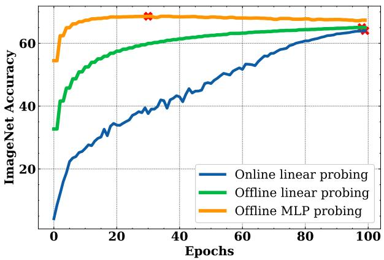

图 13：来自 Bordes et al. [2023a] 的图。描绘了在 SimCLR 训练期间（在线）和训练后（离线）使用线性或 MLP 分类器，从 Resnet50 主干的输出预测 Imagenet-1k 标签的分类器探针。红色的叉号对应最佳准确率。在离线设置中，没有使用数据增强。我们清楚地观察到 (i) 当使用 MLP 时，只需要几个轮次，并且应该使用正则化或早停；然而，在流行的线性情况下，我们清楚地看到在线和离线性能之间差异有限，并且在两种训练情况下都不会发生过拟合。

## 3.7.2 无标签评估

正如我们刚才讨论的，大多数评估依赖于使用标签和训练辅助模型。这会使评估成本高昂，并且对超参数或其优化敏感。为了帮助缓解这些问题，已经提出了多种方法，可以在不依赖标签的情况下评估方法或帮助调整超参数。使用诸如旋转预测之类的代理任务可以促进无标签的性能评估，如 Reed et al. [2021] 在数据增强策略选择中所展示的那样。然而，这种方法的一个缺点是要求为代理任务训练分类器，并且假设旋转不是预训练增强的一部分，否则模型将对其保持不变。在 Li et al. [2022a] 中，表示的特征谱与损失值结合使用来评估性能。虽然显示了与性能的相关性，但它需要根据排名和损失值训练一个性能分类器，这使得它难以用于无监督评估。在 Agrawal et al. [2022] 中，引入了 $\alpha { \mathrm { - R e Q } }$ 通过观察投影器之前表示的特征谱衰减来评估方法。

| 数据集 | 方法 | VICReg / COV. | VICReg / inv. | SimCLR | DINO / t-temp. | DINO / s-temp. |
| --- | --- | --- | --- | --- | --- | --- |
| ImageNet | ImageNet Oracle | 68.2 | 68.2 | temp. 68.5 | 72.3 | 72.4 |
| ImageNet | α-ReQ | 67.9 | 67.5 | 63.5 | 71.7 | 66.2 |
| ImageNet | RankMe | 67.8 | 67.9 | 67.1 | 72.2 | 72.4 |
| OOD | ImageNet Oracle | 68.7 | 68.7 | 68.7 | 71.9 | 72.5 |
| OOD | α-Reg | 68.1 | 67.8 | 65.1 | 71.8 | 68.5 |
| OOD | RankMe | 67.7 | 68.3 | 67.6 | 71.8 | 72.5 |

表 3：使用常见的监督线性探针策略（ImageNet oracle）、RankMe 和 α-ReQ 进行超参数选择。OOD 表示在 iNaturalist18、Places 205、Sun397、EuroSat、StanfordCars、CIFAR-10、CIFAR-100、Pascal VOC2007、CLEVR-cnt 和 FOOD101 上的平均性能。无需任何标签、优化或参数，RankMe 恢复了使用 ImageNet 验证集获得的大部分性能，突显了其作为超参数选择工具的优势。来自 Garrido et al. [2022a]

另一种评估自监督学习方法的简单方法，称为 RankMe，由 Garrido et al. [2022a] 引入。其思想是使用表示的有效秩，定义为嵌入奇异值分布的熵。它可以计算为：

$$
\mathrm{RankMe} ( Z ) = \exp \left( - \sum _ { k = 1 } ^ { \operatorname*{min} ( N , K ) } p _ { k } \log p _ { k } \right) , \ p _ { k } = \frac { \sigma _ { k } ( Z ) } { \| \sigma ( Z ) \| _ { 1 } } + \epsilon\tag{17}
$$

它被证明是良好性能的必要条件，尽管你可以获得满秩表示但结果退化（例如，元素从高斯分布中独立同分布采样的随机矩阵）。虽然这不能用于评估不同的方法，但它对于超参数选择效果很好，如表 3 所示。

## 3.7.3 超越分类

虽然分类是评估自监督学习模型的常用性能指标，但考虑其他类型的视觉任务也很重要。诸如目标检测和语义分割等任务越来越受欢迎，因为它们要求模型学习更复杂的视觉信息表示。近期工作 Caron et al. [2021], Zhou et al. [2022a], Bardes et al. [2022] 已经证明了自监督学习在这些任务上的有效性。然而，一个局限性是目前没有标准化的协议来评估自监督模型在这些任务上的表现。存在各种评估方法，例如在下游任务上微调编码器，或使用编码器作为特征提取器。需要进一步研究，以在自监督学习的背景下为这些任务建立标准化的评估协议。

## 3.7.4 可视化评估

另一种评估表示中包含或不包含哪些信息的方法是，在表示上使用一个能够将这些信息映射回像素空间的解码器。像 [He et al., 2022] 这样的方法内置了特定的解码器，使得这种可视化分析变得容易，然而大多数自监督学习方法并没有附带解码器。为了缓解这个问题并允许研究人员可视化任何类型的自监督学习方法可以学到什么，Bordes et al. [2022b] 建议使用自监督学习表示作为条件，训练一个条件生成扩散模型。通过分析在使用特定条件时，不同生成样本中哪些信息保持不变，哪些信息不保持不变（由于生成模型中的随机性），可以了解表示中包含哪些信息。如果表示编码了关于每个像素的所有信息，条件生成模型将利用这些信息的每一个比特来进行完美的重建，这将导致不同样本之间没有方差。如果表示只编码了类别信息，条件生成模型将只能利用该信息重建属于该类别的图像，这意味着在生成不同样本时，对象类别将保持不变，但背景/上下文/颜色会随样本变化。在图 14 中，我们展示了 Bordes et al. [2022b] 如何使用 RCDM 来比较在投影器级别学习到的表示与在主干网络级别学习到的表示。在该图中，我们观察到投影器级别的表示更加不变，因为颜色/背景信息在不同样本之间不保持不变，而在主干网络级别则不是这样。

## 3.8 加速训练

## 3.8.1 分布式训练

训练自监督模型通常需要较大的批大小 [Chen et al., 2020b, He et al., 2020b]，或者可以通过增加批大小来显著加速，而这最终受限于训练模型的设备内存容量。分布式训练将批次划分到多个并行运行的设备上，从而增加了批次的总大小。这主要通过 DDP（分布式数据并行）或 FSDP（全分片数据并行）实现，这些方法可在 FairScale [FairScale, 2021] 或 Apex [NVidia, 2021] 等库中获得。然而，一些自监督方法依赖于当前批次的统计信息来计算其损失值 [Chen et al., 2020b, Zbontar et al., 2021, Bardes et al., 2021]，在跨设备分布训练时必须考虑这一点。在本节中，我们介绍了为了正确分布常见自监督学习方法的训练而需要考虑的要素。我们将分布在设备上的完整批次大小称为有效批大小，将单个设备上每个子批次的大小称为每设备批大小。

**同步批归一化。** 批归一化是稳定神经网络训练以及提升网络性能的最常用技术之一。它存在于自监督学习中使用的多数卷积主干网络中，尤其是 ResNet。批归一化使用当前批次的统计信息，这些信息需要在分布式训练中进行聚合。在 PyTorch 中，可以通过以下方式包装分布式模型来轻松实现：`model = torch.nn.SyncBatchNorm.convert_sync_batchnorm(model)`。这将把网络中的所有 BatchNorm 模块替换为一个自定义的 BatchNorm 类，该类会自动聚合统计信息。

Cond.
RCDM Samples
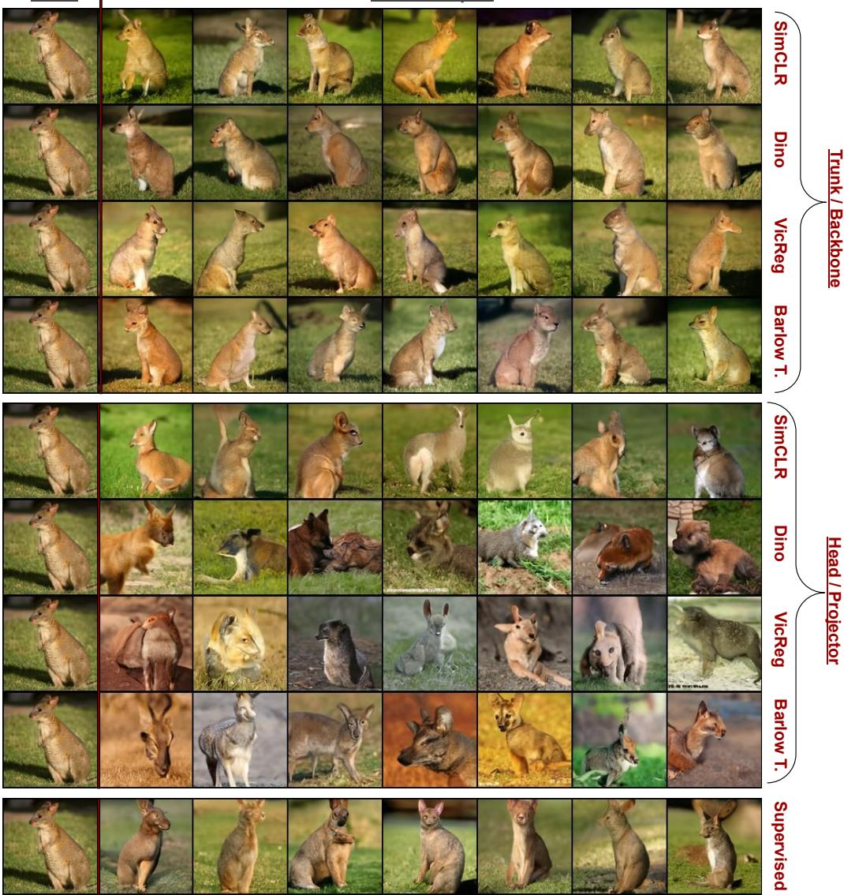

图 14：来自 Bordes 等人 [2022b] 的图表。RCDM 可视化各种表示中编码了什么？第一行到第四行显示了以通常的 resnet50 主干网络表示（大小为 2048）为条件的样本，而第五行到第八行显示了以各种 SSL 模型的投影器/头部表示为条件的样本。（注意，为每种表示单独训练了一个独立的生成模型）。一组生成图像中共同/稳定的方面揭示了条件表示中编码的内容。变化的方面则揭示了表示中未编码的内容。我们清楚地看到，与主干网络表示相反，投影器表示仅保留全局信息而不保留其上下文。这表明 SSL 模型中的不变性主要在投影器表示中实现，而非主干网络。此外，这也证实了表 a) 的线性分类结果，该结果表明主干网络表示更适合分类，因为它们包含比投影器级别表示更多的关于输入的信息。

**聚合批次以进行精确损失计算。** 批归一化并非唯一对批次进行操作的操作，多个自监督损失函数也是如此，例如 SimCLR [Chen et al., 2020b] 使用当前批次中的样本作为其对比损失的负样本，或 VICReg [Bardes et al., 2021] 计算其嵌入的协方差矩阵。在这些情况下，需要手动将每个设备的批次聚合到完整批次中。这可以使用 PyTorch 的 `all_gather` 操作来完成，但是该操作不允许通过它进行反向传播。因此，我们实现了一个支持反向传播的自定义 gather 操作，代码如下：

```python
算法 1：
class GatherLayer(torch.autograd.Function):
    """
    从所有进程中收集张量，并支持跨进程的梯度反向传播。
    """
    @staticmethod
    def forward(ctx, x):
        output = [torch.zeros_like(x) for _ in range(dist.get_world_size())]
        dist.all_gather(output, x)
        return tuple(output)

    @staticmethod
    def backward(ctx, *grads):
        all_gradients = torch.stack(grads)
        dist.all_reduce(all_gradients)
        return all_gradients[dist.get_rank()]
```

我们对梯度使用 `all_reduce` 操作，该操作对梯度求和，因为 DDP 稍后会将其除以设备数量。可以通过简单地在输入 x 上调用 `FullGatherLayer.apply(x)` 来使用该操作。实际上，对于上述方法，这需要在计算损失之前对嵌入执行。

**额外技巧。** 我们建议始终使用有效批大小作为训练脚本的参数，以及用于比较运行。`DataLoader` 类将每设备批大小作为参数，可以通过将有效批大小除以设备数量（在 PyTorch 中为 `world_size`）来获得。我们还建议使用随有效批大小缩放的自适应学习率，例如使用 `effective_lr = base_lr * effective_batch_size / 256`，其中 `base_lr` 是训练脚本的参数。这减少了在更改批大小时的搜索范围。当使用小批大小时，Chen 等人 [2020b] 建议使用 `effective_lr = base_lr * sqrt(effective_batch_size) / 256`。

### 3.8.2 使用 FFCV 和其他加速实现更快的训练

由于大多数联合嵌入 SSL 方法需要不同的手工数据增强，数据处理可能成为训练 SSL 模型时的真正瓶颈。一些方法<sup>4</sup> 使用 DALI 作为 PyTorch Vision 的替代数据加载器，而另一些方法则依赖于基于 FFCV 库 [Leclerc et al., 2022] 的 FFCV-SSL<sup>5</sup>。FFCV-SSL [Bordes et al., 2023a] 表明，可以在单个 GPU 上不到 2 天的时间内，或使用 8 个 GPU 仅需几小时，在 ImageNet 上训练 SimCLR（图 15）。

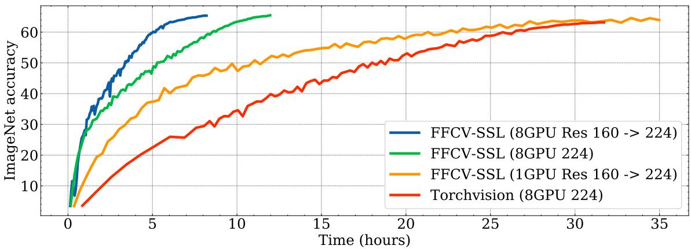

图 15：来自 Bordes 等人 [2023a] 的图表。SimCLR 训练期间 ImageNet 验证准确率（y 轴）与训练时间（x 轴）的关系。FFCV-SSL 是一个专门为自监督学习优化的库，它扩展了原始的 FFCV 库 [Leclerc et al., 2022]。与 torchvision 相比，FFCV-SSL 实现了 3 倍的加速，并使得在单个 GPU 上不到 2 天内训练 SSL 模型成为可能。

### 3.8.3 加速 Vision Transformer 的训练

训练 ViT 可以变得更高效，原因有二。首先，ViT 可以轻松地不处理所有图块。这在使用掩码预测预训练目标（如 MAE [He et al., 2022] 或 Masked Siamese Networks [Assran et al., 2022b]）时尤其有用。例如，使用 ViT 和此类目标，Data2vec 2.0 [Baevski et al., 2022] 在 32 个 GPU 上仅预训练 3 小时即可达到 84% 的 top-1 准确率。

第二个原因与架构有关。由于 Transformer [Vaswani et al., 2017] 几乎应用于计算机科学的所有领域，许多工作旨在减少注意力机制的计算和内存需求。一种方法是使用低秩和/或稀疏近似机制 [Kitaev et al., 2020, Choromanski et al., 2020, Wang et al., 2020a, Chen et al., 2021a, Zaheer et al., 2020]。例如，Li 等人 [2022b] 使用稀疏自注意力来提高 SSL 视觉模型中的效率。另一种方法是采用 IO 感知优化 [Ivanov et al., 2021]，其中最著名的可能是 FlashAttention [Dao et al., 2022]。

这些加速在开源库中可用：Fairseq [Ott et al., 2019]、FairScale [FairScale, 2021]、XFormers [Lefaudeux et al., 2022]、Apex [NVidia, 2021] 等。

加速 Vision Transformer 训练的另一种简单方法是使用 PyTorch bfloat16，它允许更快的训练，同时保持与 float32 相同的精度范围（这有助于避免在 float16 中训练 Vision Transformer 时可能遇到的常见数值不稳定性问题）。

## 4 将自监督学习扩展到图像和分类之外

### 4.1 其他数据领域的策略

使用自监督目标预训练大型模型不仅在视觉系统中很流行，在音频、文本和表格数据中也是如此。现有 SSL 方法在这些领域的性能各不相同——在语言模型上取得了最先进的成果，但在表格数据上成功有限——这可能反映了自监督的适用性差异，或者 SSL 文献中对各个领域投入的关注度存在巨大差异。

将 SSL 技术应用于任何这些数据领域都需要谨慎，因为每个领域都会出现独特的挑战，需要特殊考虑。例如，视觉的 SSL 通常围绕数据增强展开，而这些增强可能不自然地适用于语音信号。对比学习中可用的“正样本对”从同一图像略微不同的视图到音频记录完全不同的片段各不相同。尽管如此，对比目标和生成目标都可以应用于这些其他数据领域。跨数据类型的一种通用有效技术是掩码。无论是预测句子中缺失的单词、图像中的像素还是表格行中的条目，掩码都是跨领域 SSL 方法的一个有效组成部分。

本节并非旨在全面调查其他数据模态的自监督，因为每个领域都非常庞大。特定领域的综述可以在 Liu 等人 [2022a]（音频）、Schiappa 等人 [2022b]（视频）、Min 等人 [2021]（文本）和 Rubachev 等人 [2022]（表格数据）中找到。相反，本节旨在讨论 SSL 如何应用于音频、文本和表格数据的有趣相似之处和差异。

**音频数据。** 音频信号，无论是原始音频还是梅尔频谱图，与图像有很多共同点。作为神经网络的输入，它们有很强的相似性。例如，卷积可能很有用 [Oord et al., 2016, Schneider et al., 2019, Baevski et al., 2021]。但作为 SSL 的数据，出现了重大差异。例如，水平翻转图像通常不会改变图像的语义含义（并且是一种非常流行的数据增强），但对于语音记录，这将完全扭曲数据。类似地，虽然掩码图像通常使用随机像素，但频谱图的两个维度代表时间和频率，使用水平和/或垂直条带进行掩码更有效 [Wang et al., 2020b]。此外，除了语音之外的其他音调（背景噪声、房间音调）的存在，在为对比学习寻找正样本对时提出了独特的挑战，即防止学习到的表示过度拟合给定片段中的噪声 [Oord et al., 2018, Wang et al., 2020b]。事实上，通常与语义含义无关的高频噪声伪影意味着在输入空间中进行重建比其他领域（例如文本）更复杂。另一方面，多模态模型可以将一段音频及其文本 [Sermanet et al., 2018, Chung et al., 2018] 或视频的某些帧和相应的音频片段 [Zhao et al., 2018, Alwassel et al., 2020] 视为用于对比学习的不同视图，作为正样本对。

**视频数据。** 大多数 SSL 图像方法都有对应的视频 SSL 方法。例如，Feichtenhofer 等人 [2021] 将 SimCLR、MoCo、SwAV 和 BYOL 推广到了时空视频数据。实际上，在所有这些方法中，都可以融入同一视频不同时间片段之间的相似性概念。最近，视频的掩码自编码目标也建立在与图像相同的思想基础上，但通过在时间轴上掩码图块/图块管来实现 [Feichtenhofer et al., 2022, Tong et al., 2022, Girdhar et al., 2022]。此外，常见做法是使用 SSL 视觉预训练模型用于视频下游任务，如动作识别。例如，对于 ViT，可以通过沿时间轴重复权重将图块嵌入卷积层从 2D 转移到 3D [Feichtenhofer et al., 2022]。然后，视觉模型可以通过将其用作在视频任务上进行微调的初始化来转移到视频模型 [Fang et al., 2022a]。也可以直接使用帧特征，方法是在特征之上附加一个线性层 [Radford et al., 2019]，或使用更复杂的头部 [Ni et al., 2022, Arnab et al., 2021]。在这种情况下，视觉系统被冻结，时间信息在之后学习。

**文本数据。** 与音频数据相比，文本是一个相对干净的输入信号，并且对重建有用的表示不会过度拟合信号的噪声部分。事实上，最流行的大语言模型都是使用重建目标训练的，而不是其他数据领域流行的对比目标 [Radford et al., 2018, 2019, Brown et al., 2020, Devlin et al., 2018]。Word2Vec 目标 [Mikolov et al., 2013] 预测训练文本中被掩码的部分，这已成为自然语言中自监督学习的基础目标。虽然不常见，但语言建模可以通过对比学习来完成，用于词或字符表示 [Chen et al., 2022]。文本和图像之间的另一个区别是，文本的掩码词元预测是在整个字典上进行的。这种方法在图像中并不占主导地位，但已在像素级别进行过尝试 [Chen et al., 2020a]。虽然对于不改变语义含义的语言数据几乎没有增强，但大规模系统通常使用足够的数据和各种类型的掩码来克服这一点。具体来说，下一个词元预测 [Radford et al., 2018, 2019, Brown et al., 2020] 类似于掩码字符串中的最后一个词元，而双向编码器掩码字符串中任意位置的词元 [Devlin et al., 2018] 或填充更大范围的缺失文本 [Rafel et al., 2020, Tay et al., 2022]。这种单向下一个词元预测与双向方法的选择导致了文本下游应用中的显著差异 [Artetxe et al., 2022]。对于对比学习，正样本对通常来自掩码和/或裁剪输入序列 [Meng et al., 2021, Giorgi et al., 2021]。它们也可以使用 dropout 生成，使得一个输入具有两个不同的潜在表示 [Gao et al., 2021]。此外，一些对比和重建预训练方法会使用其他几种增强来破坏输入，包括文档旋转、句子排列和词元删除 [Lewis et al., 2020, Rafel et al., 2020, Wu et al., 2018]。

**表格数据。** 与文本、音频和图像不同，经典的机器学习工具在处理表格数据方面仍然很流行。然而，虽然表格数据的深度学习是一个相对较小的领域，但寻找合理的数据增强策略已经是一个研究较多的课题。几种用于表格数据的 SSL 方法以各种方式利用掩码，一些技术创造性地使用了为图像开发的其他增强，如 mixup [Zhang et al., 2018]。与图像和音频一样，一些算法旨在生成缺失或损坏的值，而另一些则采用对比学习。在组合优化中，例如混合整数规划（MIP），目标函数被用作指导，以生成具有可比目标的正解对，以及那些尽管少数变量发生微小变化但目标值却显著不同的负解对 [Huang et al., 2023]。类似的方法也用于引导语言生成 [Yang et al., 2023]。

掩码重建方法涵盖了多种掩码策略。此外，对于表格数据，预测掩码向量作为前置任务也很常见 [Yoon et al., 2020, Iida et al., 2021]。由于预测掩码本身是预训练目标的一部分，因此必须填充输入中的掩码条目，通常通过从该列或特征的经验分布中采样来完成。

使用相同的增强，即掩码和从经验边际分布中采样，Bahri 等人 [2021] 提出了使用对比损失进行预训练。具体来说，他们建议使用 InfoNCE 损失 [Gutmann and Hyvärinen, 2010, Ceylan and Gutmann, 2018] 来比较干净输入和损坏输入的表示。

其他几项工作概述了为生成和对比学习的组合增强数据的方法。例如，表格数据可以分成列组，这样每个样本（行）就有多个可用的视图 [Ucar et al., 2021]。借鉴视觉系统，输入空间中的 CutMix [Yun et al., 2019] 和嵌入空间中的 mixup [Zhang et al., 2018] 的组合也是表格数据的有效增强 [Somepalli et al., 2021]。这些方法生成增强视图，与干净输入一起用于对比学习。然而，对于 SAINT 模型 [Somepalli et al., 2021] 和 SubTab [Ucar et al., 2021] 的对比预训练，当与重建损失项配对时似乎效果最佳。

在专注于比较表格数据 SSL 方法的工作中，Rubachev 等人 [2022] 发现预训练目标通常确实有助于提升表格模型的性能。但更具体地说，他们发现使用标签的预训练目标效果最好，这意味着表格数据的 SSL 尚未成为其领域内的最先进技术 [Rubachev et al., 2022]。类似地，Levin 等人 [2023] 表明，与计算机视觉不同，现有的 SSL 预训练流程产生的特征可迁移性不如监督预训练。

强化学习。自监督学习已被用于改进基于视觉输入的强化学习。此设置与视频类似，区别在于除了图像序列外，我们还能获取动作序列。在此应用SSL最常用的方法是使用对比学习来训练模型，使其匹配当前状态表示与下一时间步的表示，或匹配同一状态经过不同数据增强后的表示。最早的例子之一是CURL [Srinivas et al., 2020]。最近，SSL已被用于提高具有挑战性的Atari100k基准 [Kaiser et al., 2020] 上的样本效率。近期工作通过将连续时间步观测的图像输入到孪生网络的两个分支，修改了BYOL [Grill et al., 2020] 或Barlow Twins [Zbontar et al., 2021]：SGI [Schwarzer et al., 2021b] 和Barlow Balance [Zhang et al., 2022c] 将其用于离线预训练，而SPR [Schwarzer et al., 2021a] 则将其作为在线设置中的附加目标。在此方面表现最佳的方法是EfficientZero [Ye et al., 2021]，它通过（除其他修改外）添加SimSiam [Chen and He, 2020] 目标来训练编码器和前向模型，从而修改了MuZero [Schrittwieser et al., 2020]，并在Atari100k上树立了新的当前最优水平。Parisi等人 [2022] 提出了PVR，一种基于MoCo [He et al., 2020a] 的方法，可提高控制任务的样本效率。Eysenbach等人 [2022] 表明，RL设置中的对比学习直接与目标条件RL相关，并证明基于InfoNCE [Oord et al., 2018] 的方法在机械臂控制任务上取得了优异性能。

SSL已被证明能为行为克隆生成良好的表示。Pari等人 [2022] 表明，使用BYOL [Grill et al., 2020] 微调的ImageNet预训练模型可以非常有效地用于机器人推、推和堆叠任务的视觉模仿，而Arunachalam等人 [2022] 使用类似方法，成功地从使用VR收集的小型操作数据集中学习。Guzey等人 [2023] 提出了一种方法，使用BYOL从机械臂的触觉传感器中提取信息，以改进灵巧操作。Cui等人 [2022] 表明，在使用Transformer架构建模目标条件轨迹时，视觉输入的BYOL表示也很有用。

将SSL应用于RL时还存在一些额外的挑战。首先，如果数据是在线记录的，单个观测值之间高度相关且非独立同分布，因此应谨慎地从回放缓冲区中采样。将SSL目标应用于RL智能体数据时的一个失败模式是倾向于锁定“慢特征” [Sobal et al., 2022]。例如，对比目标可能只学习查看天空中的云层模式来区分自动驾驶数据集中的帧，因此必须谨慎设计数据增强，以去除图像中无用的静态特征，或相应地采样数据。

SSL不仅用于提高样本效率，还用于改进探索。Guo等人 [2022b] 提出了BYOL-Explore，它使用BYOL [Grill et al., 2020] 学习编码器和前向模型，并将前向模型的不一致性作为探索目标。后续工作Jarrett等人 [2022] 解决了BYOL-Explore锁定在噪声TV上的问题。Yarats等人 [2021] 提出使用类似于SwAV [Caron et al., 2020] 的聚类方法进行无监督探索，即仅使用内在奖励进行探索。

一些工作探索了利用大量可用的自然视频数据为RL智能体预训练表示。Xiao等人 [2022] 引入了MVP，它使用掩码自编码器为机器人控制预训练Transformer编码器，而Ma等人 [2022] 提出了VIP，一种使用ResNet-50主干网络和基于观测中帧间时间作为监督信号的目标来学习RL通用特征的方法。另一种为RL训练基础模型的方法R3M [Nair et al., 2022] 结合了时间对比和视频-语言对齐目标。VIP和R3M在大型Ego4D数据集 [Grauman et al., 2022] 上训练，而MVP则结合了ImageNet、Ego4D和额外的手部操作数据。Majumdar等人提出了VC-1，一种基于掩码自编码的方法。作者在名为CortexBench的新测试套件上测试了所提方法和其他基础模型。该基准包括控制、物体操作和导航任务，不同方法在基准的不同部分表现出色。

还有一些专门针对RL且不常用于图像的无监督表示学习方法：例如拉普拉斯特征映射 [Machado et al., 2017]、前向-后向表示 [Touati et al., 2023]。Zhang等人 [2021] 提出通过学习表示，使得导致相同奖励的状态具有相同表示，否则表示不同。

## 4.2 将多模态融入SSL训练

自监督学习不必基于单一模态。特别是多模态视觉-语言最近已展示了其巨大效果。对比语言-图像预训练 (CLIP) [Radford et al., 2021] 和ALIGN [Jia et al., 2021] 是使用图像-描述对来学习图像和描述联合嵌入空间的自监督学习方法。这里的目标是对比性的，给定一个图像及其描述，分别通过独立的编码器模型将每个模态编码为固定长度的嵌入向量。训练数据中图像-描述对的嵌入被拉近，而批次中的其他组合则被推远。

与第2.6.1节讨论的基于纯视觉的对比SSL相比，这种方法尤其有趣。使用第二种模态（此处为文本）锚定了整个SSL训练。不再需要生成多个增强视图来形成鲁棒表示的概念，因为联合方法仅通过观察相似的描述与相似的图像重复出现，就能学习到语义上有意义的表示。

因此，这种联合预训练产生的图像编码器对不改变语义的视觉变化（例如在ImageNet-Sketch [Wang et al., 2019, Radford et al., 2021] 中评估的物体素描）特别鲁棒，并且在域外泛化任务上表现强劲。然而，这并不总是期望的表示，正如Ghiasi等人 [2022] 的可视化所示，这些模型也会将视觉上不同但语义上或字面上相似的特征分组。这可以通过结合图像-文本和图像-图像SSL来缓解，甚至可以提高整体性能（例如在线性探测中），如Mu等人 [2022] 所做的那样，他们结合了CLIP和SimCLR [Radford et al., 2021, Chen et al., 2020b]。

近期工作已将这些视觉-语言系统推向更大规模 [Ding et al., 2021, Yuan et al., 2021, Singh et al., 2022, Wang et al., 2022d, Fang et al., 2022b]，这些系统基于从互联网收集的免费图像-描述对，例如 [Schuhmann et al., 2022]。这些现代SSL模型能够表示视觉和文本，并可用于许多多模态应用，从视觉问答到多模态生成 [Alayrac et al., 2022, Li et al., 2022c, Nichol et al., 2022, Rao et al., 2022]。

视觉-语言预训练的未来，作为仅靠视觉学习鲁棒视觉表示的替代方案，仍有待进一步探索。虽然其在视觉-语言下游应用中的优势显而易见 [Shen et al., 2022, Dou et al., 2022]，但也可以先单独训练视觉编码器，固定它，然后训练匹配的语言编码器来构建共享嵌入空间，如 [Zhai et al., 2022b] 所述。最终，视觉-语言模型只是大规模多模态自监督学习的第一步。原型系统，如Reed等人 [2022]，在任意输入流（从视觉和文本到表格和智能体动作）上进行自监督训练，从而学习对通用任务有帮助的可复用表示。

## 4.3 为密集预测任务构建具有定位能力的特征提取器

除了语义理解，从目标检测到分割再到深度估计等流行的计算机视觉任务都需要提取局部化特征的模型，即包含输入图像中物体位置信息的特征。自监督学习对这些密集预测任务可能特别有价值，因为收集训练图像的分割掩码或边界框标注比分类标签昂贵得多。然而，在图像分类基准上精心调优的学习框架可能缺乏对这些密集预测任务有价值的特性。一些工作（我们注意到它们在设置、架构和学习算法上进行了不同的实验）表达了看似矛盾的发现，即现有的自监督学习策略对下游密集预测任务有效或无效 [Goyal et al., 2019, Purushwalkam and Gupta, 2020, Zhao et al., 2021, Ericsson et al., 2021b, Shwartz-Ziv et al.]。我们现在深入探讨这个讨论。

自监督学习器在定位方面的局限性。依赖增强视图或拼图变换的SSL方法，如MoCo [He et al., 2020b] 和PIRL [Misra and Maaten, 2020]，学习的是遮挡不变性，因为它们在ImageNet上使用随机裁剪进行训练，而ImageNet中的前景物体通常很大，因此不同的裁剪包含同一物体的不同部分 [Purushwalkam and Gupta, 2020]。另一方面，它们缺乏视角不变性和类别-实例不变性。此外，Zhao等人 [2021] 认为，自监督学习器也缺乏定位信息，因为模型能够使用图像的所有部分（前景和背景）来进行预测。上述工作主要在卷积架构上进行实验。值得注意的是，Ericsson等人 [2021b] 认为，他们测试的流行SSL算法中最好的仍然是CNN，在某些检测和分割设置中，CNN仍能与其监督学习对应物取得竞争性性能。有趣的是，较旧的前置任务，如拼图或着色（这些任务早于由MoCo和SimCLR引发的近期SSL热潮），当前置任务足够“困难”时，也能取得与监督学习主干网络相竞争的性能 [Goyal et al., 2019]。

CNN还是ViT？近期工作表明，视觉Transformer (ViT) 在其学习到的表示中包含比卷积架构更优越的定位信息 [Caron et al., 2021]。而CNN需要专门设计的分割流水线来从其特征中提取定位信息，这种信息在ViT的逐图块特征中自然出现。现有的专门为Transformer设计的SSL方法证实，训练后的模型对下游检测和分割任务有效，尤其是在微调后 [Li et al., 2021b, He et al., 2022]。然而，应注意这些SSL算法在其目标函数中明确要求定位，例如通过掩码自编码，其中图块特征应包含关于图像对应部分内容的信息 [He et al., 2022]。最近，掩码自编码预训练策略已被改编用于卷积架构并取得了巨大效果，在下游目标检测和实例分割上取得了竞争性性能 [Woo et al., 2023]。此外，我们将在下面看到，各种专门为定位设计的预训练策略可以同样有效地应用于Transformer和卷积网络。

那么，如何在没有标注的情况下学习局部化特征呢？为了定制下游密集预测任务的表示，许多工作提出修改SSL流程，专门增强其特征中的定位能力。由于这些SSL预训练算法不使用分割或检测标注，它们转而依赖精心选择的无监督物体先验。

一种物体先验风格强制图像内不同位置提取的特征之间的关系，就像自监督学习过程通常强制不同图像之间的关系一样。一种这样的先验利用了相邻ViT图块通常包含相同物体的事实。与鼓励图像增强视图产生相似特征的流行对比目标不同，SelfPatch鼓励单张图像内相邻图块产生相似特征 [Yun et al., 2022]。一种相关方法DenseCL [Wang et al., 2021c] 匹配从增强样本中提取的最相似的逐像素特征，以自动处理增强在图像中移动物体的情况，并且我们只想匹配对应于同一物体的特征。最近，VICRegL [Bardes et al., 2022] 通过结合几何匹配和学习匹配，并采用非对比标准，应用了类似原理。正如基于聚类的方法对相关图像进行聚类一样，Leopart [Ziegler and Asano, 2022] 微调预训练模型以聚类图块级特征。

除了修改训练损失以改进定位外，我们还可以通过将物体放置在多个设置中来增强数据，从而使生成的模型无论物体在何处都能提取相同的特征。实例定位 [Yang et al., 2021] 利用了RoIAlign [He et al., 2017]，这是一种为目标检测器设计的算法，用于提取对应于特定图像块的特征。为此，实例定位将从一张图像前景中随机选取的图块粘贴到另外两张图像上，并仅提取对应于粘贴前景图块的特征，使用对比损失确保无论背景如何以及图像中的位置如何，前景图块都能生成相似的特征。一种竞争方法使用显著性图估计训练图像中物体的位置，然后将这些物体剪切并粘贴到背景上，并优化类似的目标 [Zhao et al., 2021]。Purushwalkam和Gupta [2020] 没有使用增强来移动物体，而是指出附近的视频帧包含相同的物体，但位置不同或视角不同，因此对视频数据进行对比学习可以达到类似的目的。

最近，UP-DETR [Dai et al., 2021] 和DETReg [Bar et al., 2022] 提出了DETR系列检测器的端到端SSL预训练。UP-DETR提出检测图像中随机选择的图块区域的边界框，条件是其像素值，同时预测其对应的SwAV [Caron et al., 2020] 嵌入。在DETReg中，检测目标使用选择性搜索算法获得，该算法不需要人工标注。类似地，检测器为每个目标边界框预测一个关联的SwAV [Caron et al., 2018] 嵌入。

用于密集预测任务的视觉-语言模型。在第4.2节中，我们看到视觉-语言模型提取语义上有意义的特征。这些特征也被近期工作用于开放词汇目标检测 [Kamath et al., 2021, Gu et al., 2021, Zareian et al., 2021, Minderer et al., 2022]。这些工作利用如前所述在带描述图像数据库上预训练的视觉和语言主干网络，并在目标检测数据上进行微调。关键在于，预训练的语言模型与图像特征提取器配对，允许开放词汇目标检测器仅通过用适当的提示查询语言模型，就能检测到微调阶段从未见过的新物体。

## 5 结论

自监督学习 (SSL) 建立了一个推进机器智能的新范式。尽管取得了许多成功，SSL仍然是一个令人生畏的领域，拥有大量方法，每种方法都有复杂的实现。由于研究进展迅速且SSL方法范围广泛，导航该领域仍然是一个挑战。这对于刚加入该领域的研究人员和从业者来说成为一个问题，反过来为SSL研究和部署设置了高门槛。我们希望我们的食谱能够通过使任何背景的好奇研究者能够导航方法领域、理解各种旋钮的作用，并获得成功使用SSL所需的专业知识，来帮助降低这些门槛。
