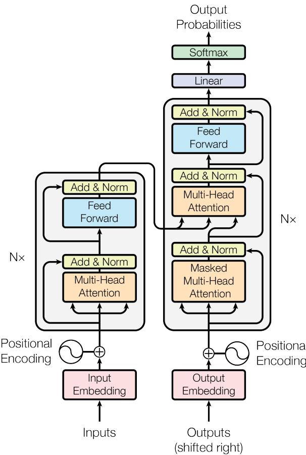

# Attention Is All You Need

> 中文题名：注意力机制即一切

## 摘要

主流的序列转导模型均基于复杂的循环神经网络或卷积神经网络，这些网络包含编码器和解码器。性能最佳的模型还通过注意力机制连接编码器和解码器。我们提出了一种新的简单网络架构——Transformer，它完全基于注意力机制，完全摒弃了循环和卷积。在两个机器翻译任务上的实验表明，这些模型在质量上更优，同时具有更高的可并行性，并且所需的训练时间显著减少。我们的模型在WMT 2014英德翻译任务上达到了28.4 BLEU，比包括集成方法在内的现有最佳结果提高了超过2个BLEU。在WMT 2014英法翻译任务上，我们的模型在8个GPU上训练3.5天后，建立了新的单模型最优BLEU分数41.8，这仅是文献中最佳模型训练成本的一小部分。我们通过将Transformer成功应用于英语成分句法分析（无论是使用大规模还是有限训练数据），证明了其能够很好地泛化到其他任务。

## 1 引言

循环神经网络，特别是长短期记忆网络[13]和门控循环神经网络[7]，已被牢固确立为序列建模和转导问题（如语言建模和机器翻译[35, 2, 5]）中的最先进方法。此后，众多研究不断推动循环语言模型和编码器-解码器架构[38, 24, 15]的性能边界。

循环模型通常沿着输入和输出序列的符号位置进行因子化计算。通过将位置与计算时间步对齐，它们生成一个隐藏状态序列 $h_t$，该序列是前一个隐藏状态 $h_{t-1}$ 和位置t处输入的函数。这种固有的顺序性质阻碍了训练样本内的并行化，这在序列长度较长时变得至关重要，因为内存限制限制了跨样本的批处理。最近的工作通过因子化技巧[21]和条件计算[32]在计算效率上取得了显著改进，同时后者还提升了模型性能。然而，顺序计算的根本约束仍然存在。

注意力机制已成为各种任务中引人注目的序列建模和转导模型不可或缺的一部分，它允许建模依赖关系而无需考虑其在输入或输出序列中的距离[2, 19]。然而，除少数情况[27]外，这种注意力机制通常与循环网络结合使用。

在这项工作中，我们提出了Transformer，一种摒弃循环并完全依赖注意力机制来捕捉输入和输出之间全局依赖关系的模型架构。Transformer允许显著更高的并行化，并且在八个P100 GPU上仅需训练十二小时即可达到翻译质量的新高度。

## 2 背景

减少顺序计算的目标也是Extended Neural GPU [16]、ByteNet [18]和ConvS2S [9]的基础，所有这些模型都使用卷积神经网络作为基本构建块，并行计算所有输入和输出位置的隐藏表示。在这些模型中，关联任意两个输入或输出位置信号所需的操作数量随位置之间的距离增长，对于ConvS2S是线性的，对于ByteNet是对数级的。这使得学习远距离位置之间的依赖关系更加困难[12]。在Transformer中，这被减少为常数次操作，尽管代价是由于平均注意力加权位置而导致有效分辨率降低，我们通过第3.2节中描述的多头注意力来抵消这种影响。

自注意力，有时称为内部注意力，是一种注意力机制，它关联单个序列的不同位置以计算该序列的表示。自注意力已成功应用于多种任务，包括阅读理解、抽象式摘要、文本蕴含和学习任务无关的句子表示[4, 27, 28, 22]。

端到端记忆网络基于循环注意力机制而非序列对齐的循环，并已被证明在简单语言问答和语言建模任务上表现良好[34]。

然而，据我们所知，Transformer是第一个完全依赖自注意力来计算其输入和输出表示，而不使用序列对齐的RNN或卷积的转导模型。在接下来的章节中，我们将描述Transformer，阐述自注意力的动机，并讨论其相对于[17, 18]和[9]等模型的优势。

## 3 模型架构

大多数有竞争力的神经序列转导模型都具有编码器-解码器结构[5, 2, 35]。在这里，编码器将输入符号表示序列 $(x_1, ..., x_n)$ 映射到连续表示序列 $\textbf{z} = (z_1, ..., z_n)$。给定z，解码器然后一次一个元素地生成输出符号序列 $(y_1, ..., y_m)$。在每一步，模型都是自回归的[10]，在生成下一个符号时，将先前生成的符号作为额外输入。

  
图1: Transformer - 模型架构。

Transformer遵循这种整体架构，对编码器和解码器都使用堆叠的自注意力和逐点全连接层，分别如图1的左半部分和右半部分所示。

## 3.1 编码器和解码器堆栈

编码器：编码器由 $N=6$ 个相同层的堆栈组成。每一层有两个子层。第一个是多头自注意力机制，第二个是简单的、位置级的全连接前馈网络。我们在每个子层周围采用残差连接[11]，然后进行层归一化[1]。也就是说，每个子层的输出是 LayerNorm(x + Sublayer(x))，其中 Sublayer(x) 是子层本身实现的函数。为了便于这些残差连接，模型中的所有子层以及嵌入层都产生维度为 $d_{\mathrm{model}} = 512$ 的输出。

解码器：解码器也由 $N=6$ 个相同层的堆栈组成。除了每个编码器层中的两个子层之外，解码器还插入了第三个子层，该子层对编码器堆栈的输出执行多头注意力。与编码器类似，我们在每个子层周围采用残差连接，然后进行层归一化。我们还修改了解码器堆栈中的自注意力子层，以防止位置关注后续位置。这种掩码，加上输出嵌入偏移一个位置的事实，确保位置i的预测只能依赖于位置小于i的已知输出。

## 3.2 注意力

注意力函数可以描述为将查询和一组键-值对映射到输出，其中查询、键、值和输出都是向量。输出被计算为值的加权和，

  
图2: (左) 缩放点积注意力。(右) 多头注意力由多个并行运行的注意力层组成。

其中分配给每个值的权重由查询与相应键的兼容性函数计算得出。

## 3.2.1 缩放点积注意力

我们将我们的特定注意力称为“缩放点积注意力”（图2）。输入包括维度为 $d_k$ 的查询和键，以及维度为 $d_v$ 的值。我们计算查询与所有键的点积，每个除以 $\sqrt{d_k}$，并应用 softmax 函数以获得值的权重。

在实践中，我们同时计算一组查询的注意力函数，这些查询被打包成一个矩阵 $Q$。键和值也分别被打包成矩阵 $K$ 和 $V$。我们计算输出矩阵为：

$$
\mathrm{Attention}(Q, K, V) = \mathrm{softmax}(\frac{QK^T}{\sqrt{d_k}})V\tag{1}
$$

两种最常用的注意力函数是加性注意力[2]和点积（乘性）注意力。点积注意力与我们的算法相同，除了缩放因子 $\frac{1}{\sqrt{d_k}}$。加性注意力使用具有单个隐藏层的前馈网络计算兼容性函数。虽然两者在理论复杂度上相似，但点积注意力在实践中更快且更节省空间，因为它可以使用高度优化的矩阵乘法代码实现。

虽然对于较小的 $d_k$ 值，两种机制表现相似，但对于较大的 $d_k$ 值，加性注意力优于未缩放的的点积注意力[3]。我们怀疑对于较大的 $d_k$ 值，点积的幅度会变大，从而将 softmax 函数推入梯度极小的区域4。为了抵消这种影响，我们通过 $\frac{1}{\sqrt{d_k}}$ 缩放点积。

## 3.2.2 多头注意力

我们发现，与其使用 $d_{\mathrm{model}}$ 维的键、值和查询执行单个注意力函数，不如将查询、键和值分别用不同的、学习到的线性投影 h 次线性投影到 $d_k$、$d_k$ 和 $d_v$ 维度。然后，我们对这些投影后的查询、键和值的每个版本并行执行注意力函数，产生 $d_v$ 维的输出值。这些值被拼接起来并再次投影，得到最终值，如图2所示。

多头注意力允许模型共同关注来自不同位置的不同表示子空间的信息。使用单个注意力头，平均会抑制这一点。

$$
\begin{array} { r } { \begin{array} { r l } & { \mathrm{MultiHead}(Q, K, V) = \mathrm{Concat}(\mathrm{head}_1, ..., \mathrm{head}_{\mathrm{h}}) W^O } \\ & { \qquad \mathrm{where~head}_{\mathrm{i}} = \mathrm{Attention}(Q W_i^Q, K W_i^K, V W_i^V) } \end{array} } \end{array}
$$

其中投影是参数矩阵 $\begin{array} { r } { W_i^Q \in \mathbb{R}^{d_{\mathrm{model}} \times d_k}, W_i^K \in \mathbb{R}^{d_{\mathrm{model}} \times d_k}, W_i^V \in \mathbb{R}^{d_{\mathrm{model}} \times d_v} } \end{array}$ 和 $W^O \in \mathbb{R}^{h d_v \times d_{\mathrm{model}}}$。

在这项工作中，我们采用 $h := 8$ 个并行注意力层或头。对于每个头，我们使用 $d_k = d_v = d_{\mathrm{model}} / h = 64$。由于每个头的维度降低，总计算成本与具有完整维度的单头注意力相似。

## 3.2.3 注意力在我们的模型中的应用

Transformer 以三种不同的方式使用多头注意力：

• 在“编码器-解码器注意力”层中，查询来自前一个解码器层，记忆键和值来自编码器的输出。这允许解码器中的每个位置关注输入序列中的所有位置。这模仿了序列到序列模型（如[38, 2, 9]）中典型的编码器-解码器注意力机制。

• 编码器包含自注意力层。在自注意力层中，所有的键、值和查询都来自同一个地方，在这种情况下，是编码器中前一层的输出。编码器中的每个位置都可以关注编码器前一层中的所有位置。

• 类似地，解码器中的自注意力层允许解码器中的每个位置关注解码器中直到并包括该位置的所有位置。我们需要防止解码器中的信息向左流动，以保持自回归属性。我们通过在缩放点积注意力内部将 softmax 输入中对应于非法连接的所有值掩码（设置为 $-\infty$）来实现这一点。见图2。

## 3.3 位置级前馈网络

除了注意力子层之外，我们的编码器和解码器中的每一层都包含一个全连接前馈网络，该网络分别且相同地应用于每个位置。它由两个线性变换组成，中间有一个 ReLU 激活函数。

$$
\mathrm{FFN}(x) = \max(0, xW_1 + b_1) W_2 + b_2\tag{2}
$$

虽然线性变换在不同位置上是相同的，但它们在层与层之间使用不同的参数。另一种描述方式是将其视为两个核大小为1的卷积。输入和输出的维度是 $d_{\mathrm{model}} = 512$，内层维度是 $d_{ff} = 2048$。

## 3.4 嵌入和 Softmax

与其他序列转导模型类似，我们使用学习到的嵌入将输入词元和输出词元转换为维度为 $d_{\mathrm{model}}$ 的向量。我们还使用通常的学习到的线性变换和 softmax 函数将解码器输出转换为预测的下一个词元概率。在我们的模型中，我们在两个嵌入层和 pre-softmax 线性变换之间共享相同的权重矩阵，类似于[30]。在嵌入层中，我们将这些权重乘以 $\sqrt{d_{\mathrm{model}}}$。

表1: 不同层类型的最大路径长度、每层复杂度和最小顺序操作数。n 是序列长度，d 是表示维度，k 是卷积的核大小，r 是受限自注意力中邻域的大小。
<table><tr><td>Layer Type</td><td>Complexity per Layer</td><td>Sequential Operations</td><td>Maximum Path Length</td></tr><tr><td>Self-Attention</td><td> $\overline { { O ( n ^ { 2 } \cdot d ) } }$ </td><td>O(1)</td><td>0(1)</td></tr><tr><td>Recurrent</td><td> $O ( n \cdot d ^ { 2 } )$ </td><td>O(n)</td><td> $O ( n )$ </td></tr><tr><td>Convolutional</td><td> $O ( k \cdot n \cdot \dot { d } ^ { 2 } )$ </td><td>O(1)</td><td> $O ( l o g _ { k } ( n ) )$ </td></tr><tr><td>Self-Attention (restricted)</td><td> ${ \dot { O ( r \cdot n \cdot d ) } }$ </td><td>O(1)</td><td> $O ( n / r )$ </td></tr></table>

## 3.5 位置编码

由于我们的模型不包含循环和卷积，为了使模型能够利用序列的顺序，我们必须注入一些关于序列中词元的相对或绝对位置的信息。为此，我们在编码器和解码器堆栈底部的输入嵌入中添加了“位置编码”。位置编码与嵌入具有相同的维度 $d_{\mathrm{model}}$，因此两者可以相加。位置编码有多种选择，可以是学习到的，也可以是固定的[9]。

在这项工作中，我们使用不同频率的正弦和余弦函数：

$$
\begin{array} { r } { PE_{(pos, 2i)} = \sin(pos / 10000^{2i / d_{\mathrm{model}}}) } \\ { PE_{(pos, 2i+1)} = \cos(pos / 10000^{2i / d_{\mathrm{model}}}) } \end{array}
$$

其中 pos 是位置，i 是维度。也就是说，位置编码的每个维度对应一个正弦波。波长形成从 $2\pi$ 到 $10000 \cdot 2\pi$ 的几何级数。我们选择这个函数是因为我们假设它能让模型轻松地学习通过相对位置进行关注，因为对于任何固定的偏移量 k，$PE_{pos+k}$ 可以表示为 $PE_{pos}$ 的线性函数。

我们还尝试使用学习到的位置嵌入[9]代替，并发现两个版本产生了几乎相同的结果（见表3第(E)行）。我们选择正弦版本是因为它可能允许模型外推到比训练期间遇到的序列长度更长的序列。

## 4 为什么选择自注意力

在本节中，我们比较自注意力层与常用于将变长符号表示序列 $( x _ { 1 } , . . . , x _ { n } )$ 映射到等长序列 $\left( z _ { 1 } , . . . , z _ { n } \right)$ （其中 $x _ { i } , z _ { i } \in \mathbb { R } ^ { d }$ ）的循环层和卷积层的各个方面，例如典型序列转导编码器或解码器中的隐藏层。为说明我们使用自注意力的动机，我们考虑了三个期望特性。

一是每层的总计算复杂度。二是可并行化的计算量，以所需的最小顺序操作数来衡量。

三是网络中长距离依赖的路径长度。学习长距离依赖是许多序列转导任务中的关键挑战。影响学习此类依赖能力的一个关键因素是网络中前向和反向信号必须遍历的路径长度。输入和输出序列中任意位置组合之间的路径越短，学习长距离依赖就越容易[12]。因此，我们还比较了由不同类型层组成的网络中任意两个输入和输出位置之间的最大路径长度。

如表1所示，自注意力层以恒定数量的顺序执行操作连接所有位置，而循环层需要 $O ( n )$ 个顺序操作。在计算复杂度方面，当序列长度 n 小于表示维度 d 时，自注意力层比循环层更快，这在机器翻译中最先进模型使用的句子表示（如词片[38]和字节对[31]表示）中通常是这种情况。为了提高处理极长序列任务的计算性能，可以将自注意力限制为仅考虑输入序列中以相应输出位置为中心、大小为 r 的邻域。这将使最大路径长度增加到 $O ( n / r )$ 。我们计划在未来的工作中进一步研究这种方法。

核宽度为 $k <$ n 的单层卷积层不能连接所有输入和输出位置对。要做到这一点，在连续核的情况下需要堆叠 $O ( n / k )$ 层卷积层，或在空洞卷积[18]的情况下需要 $O ( l o g _ { k } ( n ) )$ 层，这增加了网络中任意两个位置之间的最长路径长度。卷积层通常比循环层更昂贵，成本因子为 k。然而，可分离卷积[6]显著降低了复杂度，达到 $\overset { \cdot } { O ( k \cdot n \cdot d + n \cdot d ^ { 2 } ) }$ 。然而，即使 $k = n$ ，可分离卷积的复杂度也等于自注意力层和逐点前馈层的组合，这正是我们在模型中采用的方法。

作为附带好处，自注意力可以产生更具可解释性的模型。我们检查了模型中的注意力分布，并在附录中展示和讨论了示例。不仅单个注意力头清楚地学会了执行不同的任务，许多注意力头似乎还表现出与句子的句法和语义结构相关的行为。

## 5 训练

本节描述我们模型的训练方案。

## 5.1 训练数据与批处理

我们在标准的 WMT 2014 英德数据集上训练，该数据集包含约 450 万个句子对。句子使用字节对编码[3]进行编码，该编码具有约 37000 个词元的共享源-目标词汇表。对于英法任务，我们使用了更大的 WMT 2014 英法数据集，包含 3600 万个句子，并将词元分割为 32000 个词片的词汇表[38]。句子对按近似序列长度进行批处理。每个训练批次包含一组句子对，包含约 25000 个源词元和 25000 个目标词元。

## 5.2 硬件与时间安排

我们在配备 8 块 NVIDIA P100 GPU 的单台机器上训练模型。对于使用本文所述超参数的基础模型，每个训练步骤大约需要 0.4 秒。我们总共训练基础模型 100,000 步或 12 小时。对于大型模型（如表 3 底行所述），每步时间为 1.0 秒。大型模型训练了 300,000 步（3.5 天）。

## 5.3 优化器

我们使用 Adam 优化器[20]，参数为 $\beta _ { 1 } = 0 . 9 , \beta _ { 2 } = 0 . 9 8$ 和 $\epsilon = 1 0 ^ { - 9 }$ 。我们在训练过程中根据以下公式改变学习率：

$$
l r a t e = d _ { \mathrm { m o d e l } } ^ { - 0 . 5 } \cdot \mathrm { m i n } ( s t e p _ { - } n u m ^ { - 0 . 5 } , s t e p _ { - } n u m \cdot w a r m u p _ { - } s t e p s ^ { - 1 . 5 } )\tag{3}
$$

这对应于在前 warmup\_steps 个训练步骤中线性增加学习率，然后按步数的平方根倒数成比例减小。我们使用 warmup $. s t e p s = 4 0 0 0$。

## 5.4 正则化

我们在训练中采用三种类型的正则化：

表 2：Transformer 在英德和英法 newstest2014 测试集上以更低的训练成本取得了优于先前最先进模型的 BLEU 分数。
<table><tr><td rowspan="2">Model</td><td colspan="2">BLEU</td><td colspan="2">Training Cost (FLOPs)</td></tr><tr><td>EN-DE</td><td>EN-FR</td><td>EN-DE</td><td>EN-FR</td></tr><tr><td>ByteNet [18]</td><td>23.75</td><td></td><td></td><td></td></tr><tr><td>Deep-Att + PosUnk [39]</td><td></td><td>39.2</td><td></td><td> $1 . 0 \cdot 1 0 ^ { 2 0 }$ </td></tr><tr><td>GNMT + RL [38]</td><td>24.6</td><td>39.92</td><td> $2 . 3 \cdot 1 0 ^ { 1 9 }$ </td><td> $1 . 4 \cdot 1 0 ^ { 2 0 }$ </td></tr><tr><td>ConvS2S [9]</td><td>25.16</td><td>40.46</td><td> $9 . 6 \cdot 1 0 ^ { 1 8 }$ </td><td> $1 . 5 \cdot 1 0 ^ { 2 0 }$ </td></tr><tr><td>MoE [32]</td><td>26.03</td><td>40.56</td><td> $2 . 0 \cdot 1 0 ^ { 1 9 }$ </td><td> $1 . 2 \cdot 1 0 ^ { 2 0 }$ </td></tr><tr><td>Deep-Att + PosUnk Ensemble [39]</td><td></td><td>40.4</td><td></td><td> $\overline { { 8 . 0 \cdot 1 0 ^ { 2 0 } } }$ </td></tr><tr><td> $\mathrm { G N M T } + \mathrm { R I }$  Ensemble [38]</td><td>26.30</td><td>41.16</td><td> $1 . 8 \cdot 1 0 ^ { 2 0 }$ </td><td> $1 . 1 \cdot 1 0 ^ { 2 1 }$ </td></tr><tr><td>ConvS2S Ensemble [9]</td><td>26.36</td><td>41.29</td><td> $7 . 7 \cdot 1 0 ^ { 1 9 }$ </td><td> $1 . 2 \cdot 1 0 ^ { 2 1 }$ </td></tr><tr><td>Transformer (base model)</td><td>27.3</td><td>38.1</td><td> $\mathbf { 3 . 3 \cdot 1 0 ^ { 1 8 } }$ </td><td></td></tr><tr><td>Transformer (big)</td><td>28.4</td><td>41.8</td><td> $2 . 3 \cdot 1 0 ^ { 1 9 }$ </td><td></td></tr></table>

残差 Dropout 我们在每个子层的输出上应用 dropout[33]，然后将其添加到子层输入并进行归一化。此外，我们在编码器和解码器堆栈中对嵌入和位置编码的总和也应用 dropout。对于基础模型，我们使用的 dropout 率为 $P _ { d r o p } = 0 . 1$。

标签平滑 在训练过程中，我们采用了值为 $\epsilon _ { l s } = 0 . 1 [ 3 6 ]$ 的标签平滑。这会降低困惑度，因为模型学会了更加不确定，但提高了准确率和 BLEU 分数。

## 6 结果

## 6.1 机器翻译

在 WMT 2014 英德翻译任务上，大型 Transformer 模型（表 2 中的 Transformer (big)）比之前报告的最佳模型（包括集成模型）高出超过 2.0 BLEU，建立了 28.4 的新最优 BLEU 分数。该模型的配置列于表 3 的底行。训练在 8 块 P100 GPU 上耗时 3.5 天。即使是我们的基础模型也超越了所有先前发表的模型和集成模型，而训练成本仅为任何竞争模型的一小部分。

在 WMT 2014 英法翻译任务上，我们的大型模型取得了 41.0 的 BLEU 分数，超越了所有先前发表的单一模型，训练成本不到先前最优模型的 1/4。用于英法翻译的 Transformer (big) 模型使用的 dropout 率为 $P _ { d r o p } = 0 . 1$，而不是 0.3。

对于基础模型，我们使用通过对最后 5 个检查点（每 10 分钟写入一次）进行平均得到的单一模型。对于大型模型，我们对最后 20 个检查点进行平均。我们使用束搜索，束大小为 4，长度惩罚 $\alpha = 0 . 6 [ 3 8 ]$。这些超参数是在开发集上实验后选择的。我们在推理时将最大输出长度设置为输入长度 + 50，但在可能时提前终止[38]。

表 2 总结了我们的结果，并将我们的翻译质量和训练成本与文献中的其他模型架构进行了比较。我们通过将训练时间、使用的 GPU 数量以及每个 GPU 的持续单精度浮点运算能力估计值相乘来估计训练模型所用的浮点运算次数 $\mathrm { G P U } ^ { 5 }$。

## 6.2 模型变体

为了评估 Transformer 不同组件的重要性，我们以不同方式改变基础模型，在开发集 newstest2013 上测量英德翻译性能的变化。我们使用前一节所述的束搜索，但不进行检查点平均。我们在表 3 中展示了这些结果。

表 3：Transformer 架构的变体。未列出的值与基础模型相同。所有指标均针对英德翻译开发集 newstest2013。列出的困惑度是基于字节对编码的逐词片困惑度，不应与逐词困惑度进行比较。
<table><tr><td rowspan="2"></td><td rowspan="2"> $N$   $d _ { \mathrm { m o d e l } }$ </td><td rowspan="2"> $d _ { \mathrm { f f } }$ </td><td rowspan="2">h</td><td rowspan="2"> $d _ { k }$ </td><td rowspan="2"> $d _ { v }$ </td><td rowspan="2"> $P _ { d r o p }$ </td><td rowspan="2"> $\epsilon _ { l s }$ </td><td rowspan="2">train steps</td><td rowspan="2">PPL (dev)</td><td rowspan="2">BLEU (dev)</td><td rowspan="2">params  $\times 1 0 ^ { 6 }$ </td></tr><tr><td></td></tr><tr><td>base</td><td>6</td><td>512</td><td>2048</td><td>8</td><td>64</td><td>64</td><td>0.1 0.1</td><td>100K</td><td>4.92</td><td></td><td>25.8</td><td>65</td></tr><tr><td rowspan="3">(A)</td><td></td><td></td><td>1</td><td>512</td><td>512 128</td><td></td><td></td><td></td><td>5.29</td><td></td><td>24.9</td><td></td></tr><tr><td></td><td></td><td>4</td><td>128</td><td></td><td></td><td></td><td></td><td></td><td>5.00</td><td>25.5 25.8</td><td></td></tr><tr><td></td><td></td><td>16 32</td><td>32 16</td><td>32 16</td><td></td><td></td><td></td><td>4.91 5.01</td><td>25.4</td><td></td><td></td></tr><tr><td>(B)</td><td></td><td></td><td></td><td></td><td>16 32</td><td></td><td></td><td></td><td></td><td>5.16 5.01</td><td>25.1 25.4</td><td>58 60</td></tr><tr><td>(C)</td><td>2 4 8 256 1024</td><td>1024 4096</td><td></td><td>32 128</td><td>32 128</td><td></td><td></td><td></td><td></td><td>6.11 5.19 4.88 5.75 4.66 5.12</td><td>23.7 25.3 25.5 24.5 26.0 25.4</td><td>36 50 80 28 168 53</td></tr><tr><td>(D)</td><td></td><td></td><td></td><td></td><td></td><td></td><td>0.0 0.2 0.0</td><td></td><td></td><td>4.75 5.77 4.95</td><td>26.2 24.6 25.5 25.3</td><td>90</td></tr><tr><td>(E)</td><td></td><td>positional embedding instead of sinusoids</td><td></td><td></td><td></td><td></td><td></td><td>0.2</td><td></td><td>4.67 5.47</td><td>25.7 25.7</td><td></td></tr><tr><td>big</td><td>6</td><td>1024</td><td>4096 16</td><td></td><td></td><td></td><td>0.3</td><td></td><td>300K</td><td>4.92 4.33</td><td>26.4</td><td>213</td></tr></table>

在表 3 行 (A) 中，我们改变注意力头的数量以及注意力键和值的维度，同时保持计算量恒定，如第 3.2.2 节所述。虽然单头注意力比最佳设置差 0.9 BLEU，但头数过多时质量也会下降。

在表 3 行 (B) 中，我们观察到减小注意力键大小 $d _ { k }$ 会损害模型质量。这表明确定兼容性并不容易，并且比点积更复杂的兼容性函数可能是有益的。我们进一步在行 (C) 和 (D) 中观察到，正如预期，更大的模型更好，并且 dropout 对于避免过拟合非常有帮助。在行 (E) 中，我们将正弦位置编码替换为可学习的位置嵌入[9]，并观察到与基础模型几乎相同的结果。

## 6.3 英语成分句法分析

为了评估 Transformer 是否可以泛化到其他任务，我们在英语成分句法分析上进行了实验。该任务提出了特定的挑战：输出受到强结构约束，并且比输入长得多。此外，RNN 序列到序列模型在数据量小的场景下未能取得最优结果[37]。

我们在 Penn Treebank [25] 的华尔街日报 (WSJ) 部分（约 40K 训练句子）上训练了一个 4 层 Transformer，$d _ { m o d e l } = 1 0 2 4$。我们还在半监督设置下进行训练，使用了来自 [37] 的更大的高置信度和 BerkleyParser 语料库，包含约 1700 万个句子。对于仅 WSJ 设置，我们使用 16K 词元的词汇表；对于半监督设置，使用 32K 词元的词汇表。

我们仅进行了少量实验来选择第 22 节开发集上的 dropout（包括注意力和残差，第 5.4 节）、学习率和束大小，所有其他参数与英德基础翻译模型保持不变。在推理期间，我们将最大输出长度增加到输入长度 + 300。对于仅 WSJ 和半监督设置，我们均使用束大小 21 和 α = 0.3。

表 4：Transformer 能很好地泛化到英语成分句法分析（结果基于 WSJ 第 23 节）
<table><tr><td>Parser</td><td>Training</td><td>WSJ 23 F1</td></tr><tr><td>Vinyals &amp; Kaiser el al. (2014) [37] Petrov et al. (2006) [29]</td><td>WSJ only, discriminative WSJ only, discriminative</td><td>88.3 90.4</td></tr><tr><td>Zhu et al. (2013) [40]</td><td>WSJ only, discriminative</td><td>90.4</td></tr><tr><td>Dyer et al. (2016) [8]</td><td>WSJ only, discriminative</td><td>91.7</td></tr><tr><td>Transformer (4 layers)</td><td>WSJ only, discriminative</td><td>91.3</td></tr><tr><td>Zhu et al. (2013) [40]</td><td>semi-supervised</td><td>91.3</td></tr><tr><td>Huang &amp; Harper (2009) [14]</td><td>semi-supervised</td><td>91.3</td></tr><tr><td>McClosky et al. (2006) [26]</td><td>semi-supervised</td><td>92.1</td></tr><tr><td>Vinyals &amp; Kaiser el al. (2014) [37]</td><td>semi-supervised</td><td></td></tr><tr><td>Transformer (4 layers)</td><td>semi-supervised</td><td>92.1</td></tr><tr><td>Luong et al. (2015) [23]</td><td>multi-task</td><td>92.7</td></tr><tr><td>Dyer et al. (2016) [8]</td><td>generative</td><td>93.0</td></tr><tr><td></td><td></td><td>93.3</td></tr></table>]

我们在表 4 中的结果表明，尽管缺乏任务特定的调优，我们的模型表现惊人地好，除了循环神经网络语法[8]之外，优于所有先前报告的模型。

与 RNN 序列到序列模型[37]相比，即使仅在 40K 句子的 WSJ 训练集上训练，Transformer 也优于 Berkeley-Parser [29]。

## 7 结论

在这项工作中，我们提出了 Transformer，这是第一个完全基于注意力的序列转导模型，用多头自注意力取代了编码器-解码器架构中最常用的循环层。

对于翻译任务，Transformer 的训练速度明显快于基于循环层或卷积层的架构。在 WMT 2014 英德和 WMT 2014 英法翻译任务上，我们都取得了新的最优结果。在前一个任务中，我们最好的模型甚至超越了所有先前报告的集成模型。

我们对基于注意力的模型的未来感到兴奋，并计划将它们应用于其他任务。我们计划将 Transformer 扩展到涉及文本以外的输入和输出模态的问题，并研究局部、受限的注意力机制，以有效处理图像、音频和视频等大型输入和输出。使生成过程减少顺序性也是我们的另一个研究目标。

我们用于训练和评估模型的代码可在 https://github.com/tensorflow/tensor2tensor 获取。

致谢 我们感谢 Nal Kalchbrenner 和 Stephan Gouws 富有成果的评论、更正和启发。
